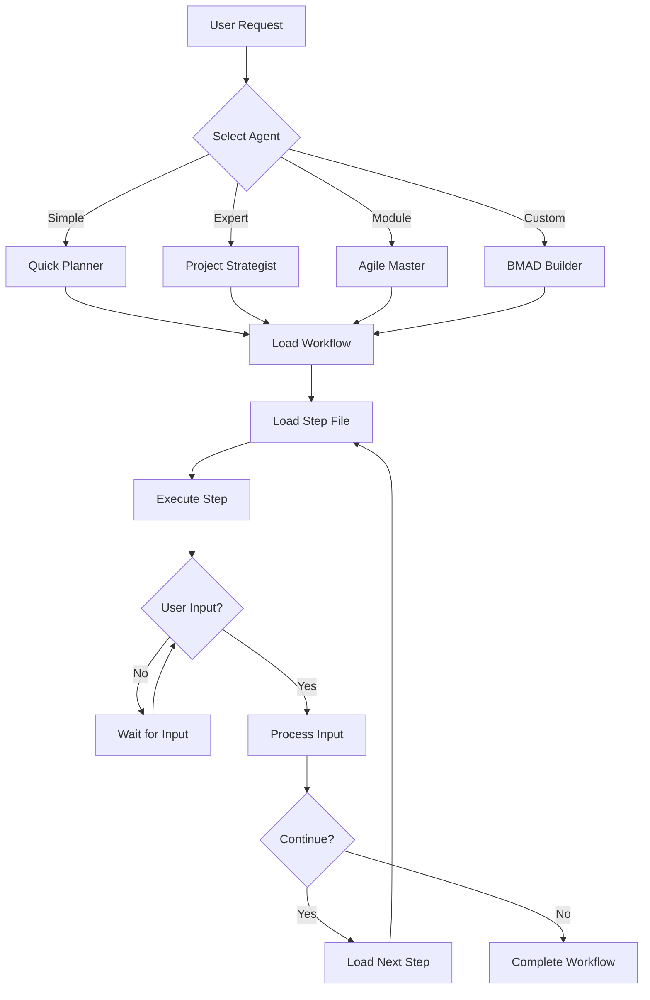
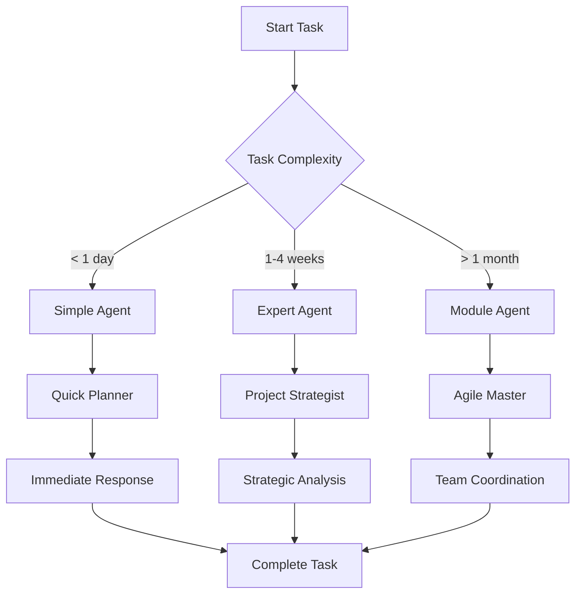
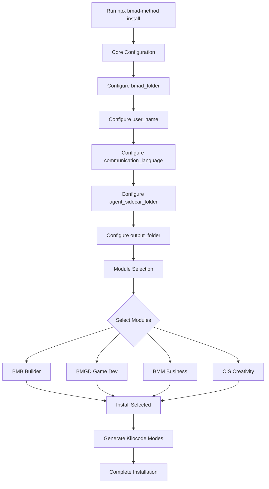

# BMAD-METHOD Web App Setup Guide for VSCode and Kilocode

**Version:** 1.0.0  
**Last Updated:** 2025-12-24  
**BMAD-METHOD Version:** 6.0.0-alpha.15

---

## Table of Contents

1. [Document Header](#document-header)
2. [Prerequisites](#prerequisites)
3. [BMAD-METHOD Overview](#bmad-method-overview)
4. [Installation Steps](#installation-steps)
5. [Project Initialization](#project-initialization)
6. [VSCode/Kilocode Configuration](#vscodekilocode-configuration)
7. [Directory Structure Reference](#directory-structure-reference)
8. [Usage Guide](#usage-guide)
9. [Troubleshooting](#troubleshooting)
10. [Reference](#reference)

---

## Document Header

This document serves as the sole source of truth for setting up a BMAD-METHOD web app development environment from scratch. It assumes no prior knowledge of BMAD-METHOD and provides complete, self-contained instructions.

---

## Prerequisites

Before installing BMAD-METHOD, ensure you have the following software installed:

### Required Software

| Software | Minimum Version | Installation Command |
|----------|----------------|---------------------|
| Node.js | 20.x or higher | Visit [nodejs.org](https://nodejs.org/) |
| npm | Comes with Node.js | Included with Node.js |
| VSCode | Latest stable | Visit [code.visualstudio.com](https://code.visualstudio.com/) |
| Kilocode Extension | Latest | Install from VSCode Marketplace |

### Verifying Prerequisites

```bash
# Check Node.js version
node --version
# Expected output: v20.x.x or higher

# Check npm version
npm --version
# Expected output: 10.x.x or higher

# Verify VSCode is installed
code --version
# Expected output: Version information
```

### Installing Kilocode Extension

1. Open VSCode
2. Press `Cmd+Shift+X` (macOS) or `Ctrl+Shift+X` (Windows/Linux)
3. Search for "Kilocode"
4. Click "Install" on the Kilocode extension
5. Reload VSCode when prompted

---

## BMAD-METHOD Overview

### What is BMAD-METHOD?

BMAD-METHOD is a revolutionary AI collaboration framework that introduces several architectural innovations designed to solve common problems in AI-assisted development:

### Core Architectural Innovations

#### 1. Step-File Architecture

A micro-file workflow system that prevents context overflow by loading only the current step into memory. Each workflow consists of:

- **Entry Point**: A main workflow file that orchestrates the process
- **Step Files**: Individual markdown files for each workflow step
- **State Tracking**: Automatic progress tracking across sessions
- **Continuation Support**: Resume from any point in the workflow

**Benefits:**
- Prevents AI context window overflow
- Enables focused, step-by-step execution
- Supports session interruption and resumption
- Maintains clear workflow boundaries

#### 2. Modular Agent System

A three-tier agent classification system that matches agent capabilities to task complexity:

| Agent Type | Description | Use Case | Memory |
|------------|-------------|-----------|--------|
| **Simple** | Stateless utility agents | Quick decisions, immediate tasks | None |
| **Expert** | Persistent memory agents | Complex analysis, pattern recognition | Persistent |
| **Module** | Team orchestration agents | Multi-agent coordination, methodology | Persistent + Sidecar |

**Benefits:**
- Right-sized AI for each task
- Efficient resource utilization
- Clear capability boundaries
- Scalable architecture

#### 3. Intent vs Prescriptive Spectrum

A framework for balancing creativity with structure in AI interactions:

| Spectrum Position | Description | When to Use |
|-------------------|-------------|--------------|
| **Intent-Based** | Creative exploration, user-led discovery | Brainstorming, ideation, discovery |
| **Balanced** | Professional expertise with flexible application | Standard development, planning |
| **Prescriptive** | Structured compliance, consistent processes | Quality assurance, compliance checks |

**Benefits:**
- Explicit control over AI behavior
- Appropriate approach for each context
- Clear expectations for both user and AI
- Consistent outcomes when needed

#### 4. Collaborative Dialogue Model

A user-controlled AI interaction pattern where the AI acts as a facilitator rather than a content generator:

**Key Principles:**
- **Facilitator Role**: AI guides, user decides
- **Equal Partnership**: Both parties contribute expertise
- **Explicit Consent**: Always asks before proceeding
- **No Assumptions**: Doesn't assume user wants next step

**Benefits:**
- User maintains control throughout
- AI provides expertise without overstepping
- Clear decision points at each step
- Transparent collaboration

#### 5. Scale-Adaptive Intelligence

Dynamic complexity adjustment based on project characteristics:

| Project Size | Duration | Team Size | Approach |
|--------------|----------|------------|-----------|
| **Small** | < 1 week | 1-2 people | Quick & Simple |
| **Medium** | 1-4 weeks | 3-5 people | Structured & Balanced |
| **Large** | > 1 month | 6+ people | Comprehensive & Detailed |

**Benefits:**
- Appropriate effort for project scope
- Efficient use of time and resources
- Scalable from individual to enterprise
- Automatic complexity adjustment

### Three-Tier Agent Classification

#### Simple Agents
- **Characteristics**: Stateless, immediate response, focused utility
- **Examples**: Quick Planner, Task Breaker, Effort Estimator
- **Best For**: Bug fixes, small features, immediate decisions

#### Expert Agents
- **Characteristics**: Persistent memory, pattern recognition, deep analysis
- **Examples**: Project Strategist, Risk Analyst, Stakeholder Manager
- **Best For**: Complex projects, strategic decisions, long-term planning

#### Module Agents
- **Characteristics**: Team orchestration, methodology guidance, comprehensive coordination
- **Examples**: Agile Master, Portfolio Manager, Compliance Officer
- **Best For**: Multi-team projects, enterprise coordination, methodology implementation

---

## Installation Steps

### Step 1: Global NPX Installation

BMAD-METHOD is installed globally via NPX, allowing you to use it across multiple projects.

```bash
# Run the BMAD-METHOD installer
npx bmad-method install
```

### Step 2: Configuration Prompts

The installer will guide you through a series of configuration prompts. Below are all prompts with recommended responses for web app development.

#### Core Configuration Prompts

```
? What is the root folder for BMAD installation? (Recommended: .bmad)
❯ .bmad
```

**Recommendation:** Accept the default `.bmad` folder. This keeps BMAD files organized and separate from your project code.

---

```
? What shall agents call you?
❯ Your Name
```

**Recommendation:** Enter your preferred name. This is how BMAD agents will address you in conversations.

---

```
? Preferred Chat Language/Style? (English, Mandarin, English Pirate, etc...)
❯ English
```

**Recommendation:** Select your preferred communication language. This affects how agents communicate with you.

---

```
? Preferred Document Output Language?
❯ English
```

**Recommendation:** This defaults to your chat language selection. Accept the default unless you need documents in a different language.

---

```
? Where should users' agent sidecar memory folders be stored?
❯ .bmad-user-memory
```

**Recommendation:** Accept the default `.bmad-user-memory`. This folder stores agent memories and personal data outside version control.

---

```
? Where should AI Generated Artifacts be saved across all modules?
❯ docs
```

**Recommendation:** Accept the default `docs` folder. This is where AI-generated documentation and artifacts will be stored.

---

```
? Install user documentation and optimized agent intelligence to each selected module's docs folder?
❯ Yes
```

**Recommendation:** Select "Yes" to install documentation that helps agents work more effectively with your project.

### Step 3: Module Selection

After core configuration, the installer will present available modules for selection.

#### Official Modules

```
? Select modules and custom content to install:
[── Official Content ──]
 ◉ BMB: BMAD Builder (Recommended for web app development)
 ◯ BMGD: BMAD Game Development
 ◯ BMM: Business Method & Management
 ◯ CIS: Creativity & Innovation Suite
```

**Recommendation for Web App Development:**
- **BMB (BMAD Builder)**: Essential for creating custom agents and workflows
- **BMM (Business Method & Management)**: Useful for project planning and management
- **CIS (Creativity & Innovation Suite)**: Helpful for brainstorming and ideation

#### Custom Content (Optional)

```
? Do you have custom content to install?
❯ No (skip custom content)
  Enter a directory path
  Enter a URL [Coming soon]
```

**Recommendation:** Select "No" for initial setup. You can add custom content later as needed.

### Step 4: Installation Completion

The installer will:
1. Create the `.bmad/` directory structure
2. Copy selected modules to your project
3. Generate `.kilocodemodes` files for VSCode/Kilocode integration
4. Create configuration files based on your responses

**Expected Output:**
```
✓ BMAD-METHOD installed successfully
✓ Modules installed: BMB
✓ Kilocode modes generated
✓ Configuration complete

Next steps:
1. Open your project in VSCode
2. Select a BMAD mode from Kilocode
3. Start collaborating with BMAD agents
```

---

## Project Initialization

### Step 1: Create a New Web App Project

This example uses Vite + React, but BMAD-METHOD works with any web framework.

```bash
# Create a new Vite + React project
npm create vite@latest my-web-app -- --template react

# Navigate to the project directory
cd my-web-app

# Install dependencies
npm install
```

### Step 2: Install BMAD into the Project

```bash
# Run the BMAD installer from your project root
npx bmad-method install
```

Follow the configuration prompts from the [Installation Steps](#installation-steps) section above.

### Step 3: Verify Installation

After installation, verify the directory structure:

```bash
# List project contents
ls -la

# Expected output should include:
# .bmad/              - BMAD installation directory
# .bmad-user-memory/  - Agent sidecar content (if configured)
# .kilocodemodes/     - Kilocode mode definitions
# docs/               - AI-generated artifacts
```

### Step 4: Initialize Git Repository

```bash
# Initialize git
git init

# Create .gitignore entries for BMAD
echo ".bmad-user-memory/" >> .gitignore
echo ".planner-memory/" >> .gitignore

# Commit initial setup
git add .
git commit -m "Initial project setup with BMAD-METHOD"
```

### Step 5: Open Project in VSCode

```bash
# Open project in VSCode
code .
```

---

## VSCode/Kilocode Configuration

### Step 1: Verify Kilocode Mode Files

BMAD automatically generates mode files in `.kilocodemodes/`. Verify these exist:

```bash
# List Kilocode mode files
ls -la .kilocodemodes/

# Expected output:
# bmad-bmb-bmad-builder.md
# bmad-core-bmad-master.md
# (Additional mode files based on installed modules)
```

### Step 2: VSCode Settings Configuration

Create or update `.vscode/settings.json`:

```json
{
  "editor.formatOnSave": true,
  "editor.defaultFormatter": "esbenp.prettier-vscode",
  "editor.codeActionsOnSave": {
    "source.fixAll.eslint": "explicit"
  },
  "files.exclude": {
    "**/.bmad-user-memory": true,
    "**/.planner-memory": true
  },
  "search.exclude": {
    "**/.bmad-user-memory": true,
    "**/.planner-memory": true,
    "**/.bmad": true
  },
  "kilocode.modesPath": ".kilocodemodes",
  "kilocode.autoLoadModes": true
}
```

### Step 3: VSCode Extensions

Ensure you have these extensions installed for optimal BMAD-METHOD experience:

| Extension | Purpose |
|-----------|---------|
| Kilocode | AI collaboration with BMAD modes |
| ESLint | Code linting |
| Prettier | Code formatting |
| GitLens | Git integration |

### Step 4: .gitignore Configuration

Update your `.gitignore` file:

```gitignore
# Dependencies
node_modules/
dist/
build/

# BMAD-METHOD
.bmad-user-memory/
.planner-memory/

# IDE
.vscode/
.idea/

# OS
.DS_Store
Thumbs.db

# Logs
*.log
npm-debug.log*
yarn-debug.log*
yarn-error.log*
```

### Step 5: Kilocode Mode Activation

BMAD modes auto-load when you open your project in VSCode. To activate a mode:

1. Open VSCode
2. Click the Kilocode mode selector in the status bar
3. Select a BMAD mode from the list (e.g., `bmad-bmb-bmad-builder`)
4. The mode is now active and ready to use

---

## Directory Structure Reference

### Complete Project Structure After BMAD Installation

```
my-web-app/
├── .bmad/                                    # BMAD installation directory
│   ├── config.yaml                            # Core BMAD configuration
│   ├── agents/                                # Agent definitions
│   │   ├── simple/                            # Simple (stateless) agents
│   │   │   └── quick-planner.agent.yaml
│   │   ├── expert/                            # Expert (persistent memory) agents
│   │   │   └── project-strategist.agent.yaml
│   │   └── module/                           # Module (orchestration) agents
│   │       └── agile-master.agent.yaml
│   ├── workflows/                             # Step-file workflows
│   │   ├── planning/                          # Planning workflows
│   │   │   ├── project-planning-workflow.md
│   │   │   └── steps/
│   │   │       ├── step-01-discovery.md
│   │   │       ├── step-02-goal-definition.md
│   │   │       └── ...
│   │   └── quality/                           # Quality assurance workflows
│   │       ├── plan-validation-workflow.md
│   │       └── steps/
│   │           └── ...
│   └── modules/                               # Installed modules
│       ├── bmb/                               # BMAD Builder module
│       │   ├── module.yaml
│       │   ├── agents/
│       │   ├── workflows/
│       │   │   ├── create-agent/
│       │   │   ├── create-module/
│       │   │   ├── create-workflow/
│       │   │   ├── edit-agent/
│       │   │   └── edit-workflow/
│       │   └── docs/
│       └── bmm/                               # Business Method module (if installed)
│           ├── module.yaml
│           ├── agents/
│           └── workflows/
│
├── .bmad-user-memory/                        # Agent sidecar content (gitignored)
│   ├── quick-planner-sidecar/
│   ├── project-strategist-sidecar/
│   └── agile-master-sidecar/
│
├── .kilocodemodes/                           # Kilocode mode definitions
│   ├── bmad-bmb-bmad-builder.md
│   ├── bmad-core-bmad-master.md
│   ├── bmad-core-project-strategist.md
│   └── ...
│
├── docs/                                      # AI-generated artifacts
│   ├── project-plans/
│   ├── architecture/
│   └── ...
│
├── src/                                       # Your web app source code
│   ├── main.jsx
│   ├── App.jsx
│   └── ...
│
├── public/                                    # Static assets
│   └── ...
│
├── .vscode/                                   # VSCode configuration
│   └── settings.json
│
├── .gitignore
├── package.json
├── vite.config.js
└── README.md
```

### Key Directory Explanations

| Directory | Purpose | Version Control |
|-----------|---------|----------------|
| `.bmad/` | Core BMAD installation and modules | Yes |
| `.bmad-user-memory/` | Agent memories and personal data | No |
| `.kilocodemodes/` | Kilocode mode definitions | Yes |
| `docs/` | AI-generated artifacts | Yes |
| `src/` | Your web application code | Yes |

---

## Usage Guide

### Activating BMAD Agents in Kilocode

#### Method 1: Via Mode Selector

1. Open your project in VSCode
2. Locate the Kilocode mode selector in the status bar (bottom right)
3. Click the selector to see available modes
4. Select a BMAD mode (e.g., `bmad-bmb-bmad-builder`)
5. The mode is now active

#### Method 2: Via Command Palette

1. Press `Cmd+Shift+P` (macOS) or `Ctrl+Shift+P` (Windows/Linux)
2. Type "Kilocode: Select Mode"
3. Select a BMAD mode from the list

#### Available BMAD Modes

| Mode Name | Display Name | Agent Type | Purpose |
|-----------|--------------|-------------|---------|
| `bmad-core-bmad-master` | 🤖 BMAD Master | Module | Core BMAD orchestration |
| `bmad-bmb-bmad-builder` | 🔧 BMAD Builder | Module | Create agents and workflows |
| `bmad-core-project-strategist` | 📊 Project Strategist | Expert | Strategic planning |
| `bmad-core-quick-planner` | ⚡ Quick Planner | Simple | Quick decisions |

### Running Workflows

#### Step 1: Select Appropriate Agent

Choose an agent based on your task complexity:

```bash
# For quick decisions and immediate tasks
Select: bmad-core-quick-planner

# For complex analysis and strategic planning
Select: bmad-core-project-strategist

# For creating custom agents or workflows
Select: bmad-bmb-bmad-builder
```

#### Step 2: Start the Workflow

Once a mode is active, interact with the agent through the Kilocode chat interface:

```
You: I need to plan a new feature for my web app

Agent: Let me help you plan this feature. I'll guide you through a structured process.

[Agent loads the appropriate workflow step file]
```

#### Step 3: Follow the Step-File Workflow

Each workflow consists of step files that guide you through the process:

```markdown
# step-01-discovery.md

## STEP GOAL: Explore project goals and context

## MANDATORY RULES
- 🛑 NEVER generate content without user input
- 📋 YOU ARE A FACILITATOR, not a content generator
- ⏸️ ALWAYS halt at menus and wait for input

## EXECUTION
[Guided exploration process]

## MENU
[E] Advanced Exploration
[P] Party Mode
[C] Continue to next step
```

#### Step 4: Provide Input and Continue

Respond to the agent's prompts and select menu options:

```
You: I want to add user authentication to my React app

Agent: Great! Let's explore the authentication requirements.

Discovery Questions:
1. What authentication method do you prefer? (OAuth, JWT, Session-based)
2. Which providers do you need? (Google, GitHub, Email/Password)
3. What user data do you need to store?

[Continue providing answers...]

Agent: Based on your requirements, here's a recommended approach...

## MENU
[C] Continue to implementation planning
[R] Revise requirements
```

### Example Web App Development Workflow

#### Scenario: Adding User Authentication

**Step 1: Activate Quick Planner Mode**

```
Mode: bmad-core-quick-planner
```

**Step 2: Initial Request**

```
You: I need to add user authentication to my React app

Agent: Let's get your authentication feature moving! I need just the basics:

Quick Setup Questions:
1. What authentication method? (OAuth, JWT, Session-based)
2. Which providers? (Google, GitHub, Email/Password)
3. What's the single most important outcome?

You: JWT with email/password authentication. Secure login is most important.

Agent: Based on your goal, here are your immediate next steps:

Start These Tasks Now:
1. Install authentication library (e.g., react-router-dom, jsonwebtoken)
2. Create login and registration components
3. Set up protected routes
4. Implement token storage and validation

Ready to tackle the first task?
```

**Step 3: Escalate to Expert Agent for Detailed Planning**

```
Mode: bmad-core-project-strategist

You: I need detailed planning for JWT authentication implementation

Agent: Let me analyze your authentication implementation through a strategic lens, drawing on patterns I've observed:

Strategic Context Analysis:
- What's worked well in similar JWT implementations?
- What are the common security pitfalls?
- How does this fit your larger application architecture?

Pattern Recognition:
Based on similar projects, here are key considerations:
- Token refresh strategy
- Secure storage (httpOnly cookies vs localStorage)
- CSRF protection
- Rate limiting

Strategic Recommendations:
1. Use httpOnly cookies for token storage (more secure than localStorage)
2. Implement token refresh with short-lived access tokens
3. Add rate limiting to prevent brute force attacks
4. Consider using a proven library like NextAuth.js or Auth0

From your project history, here are relevant insights:
[References specific past decisions and outcomes]

## MENU
[C] Continue to detailed implementation plan
[R] Revise approach
```

**Step 4: Use BMAD Builder to Create Custom Agent**

```
Mode: bmad-bmb-bmad-builder

You: I want to create a custom agent for authentication workflows

Agent: Let's create a custom authentication agent for your project!

[Loads create-agent workflow]

Step 1: Brainstorm Agent Concept
What should this agent specialize in?
- Authentication flow design
- Security best practices
- Token management
- User session handling

You: All of the above - a comprehensive authentication specialist

Agent: Great! Let's define the agent persona and capabilities...

[Continues through agent creation workflow]
```

### Agent Selection Guide

| Task Complexity | Recommended Agent | Example Use Cases |
|----------------|-------------------|-------------------|
| **Simple** | Quick Planner | Bug fixes, small features, immediate decisions |
| **Medium** | Project Strategist | Feature planning, architecture decisions, risk analysis |
| **Complex** | Agile Master | Multi-team coordination, sprint planning, methodology guidance |
| **Custom** | BMAD Builder | Creating domain-specific agents, custom workflows |

---

## Troubleshooting

### Common Issues and Solutions

#### Issue 1: BMAD Modes Not Appearing in Kilocode

**Symptoms:**
- No BMAD modes visible in Kilocode mode selector
- `.kilocodemodes/` directory is empty

**Solutions:**

1. **Verify Installation:**
   ```bash
   # Check if .kilocodemodes exists
   ls -la .kilocodemodes/
   
   # If empty, reinstall BMAD
   npx bmad-method install
   ```

2. **Check VSCode Settings:**
   ```json
   // In .vscode/settings.json
   {
     "kilocode.modesPath": ".kilocodemodes",
     "kilocode.autoLoadModes": true
   }
   ```

3. **Reload VSCode:**
   - Press `Cmd+Shift+P` (macOS) or `Ctrl+Shift+P` (Windows/Linux)
   - Type "Developer: Reload Window"
   - Press Enter

#### Issue 2: Agent Not Responding

**Symptoms:**
- Agent doesn't respond to prompts
- Workflow appears stuck

**Solutions:**

1. **Check Workflow Step:**
   - Ensure you've provided required input
   - Verify you selected a menu option (C, R, E, P)
   - Check if the step file exists in `.bmad/workflows/`

2. **Verify Agent Configuration:**
   ```bash
   # Check agent file exists
   ls -la .bmad/agents/
   
   # Verify agent YAML syntax
   cat .bmad/agents/expert/project-strategist.agent.yaml
   ```

3. **Restart Kilocode:**
   - Deactivate current mode
   - Reactivate the mode
   - Try your request again

#### Issue 3: Sidecar Content Not Working

**Symptoms:**
- Agent doesn't remember previous interactions
- Sidecar folder is empty

**Solutions:**

1. **Verify Sidecar Configuration:**
   ```bash
   # Check if sidecar folder exists
   ls -la .bmad-user-memory/
   
   # Verify agent has hasSidecar: true
   grep "hasSidecar" .bmad/agents/expert/project-strategist.agent.yaml
   ```

2. **Check Agent Instructions:**
   - Ensure agent loads sidecar content on activation
   - Verify agent writes to sidecar during interactions

3. **Reinstall with Correct Configuration:**
   ```bash
   # Reinstall BMAD
   npx bmad-method install
   
   # Ensure agent_sidecar_folder is set correctly
   # during configuration prompts
   ```

#### Issue 4: Installation Fails

**Symptoms:**
- NPX installation fails
- Error messages during installation

**Solutions:**

1. **Check Node.js Version:**
   ```bash
   node --version
   # Must be v20.x.x or higher
   ```

2. **Clear NPX Cache:**
   ```bash
   npx --yes bmad-method install --clear-cache
   ```

3. **Check Network Connection:**
   - Ensure you have internet access
   - Verify no firewall is blocking NPX

4. **Try Manual Installation:**
   ```bash
   # Clone BMAD repository
   git clone https://github.com/bmad-code-org/BMAD-METHOD.git
   cd BMAD-METHOD
   
   # Run installer locally
   npm install
   npm run install
   ```

#### Issue 5: Workflow Step Files Not Loading

**Symptoms:**
- Agent can't find step files
- Error messages about missing files

**Solutions:**

1. **Verify File Structure:**
   ```bash
   # Check workflow directory
   ls -la .bmad/workflows/planning/steps/
   
   # Verify step files exist
   ls -la .bmad/workflows/planning/steps/step-01-discovery.md
   ```

2. **Check File Permissions:**
   ```bash
   # Ensure files are readable
   chmod +r .bmad/workflows/planning/steps/*.md
   ```

3. **Verify Workflow Configuration:**
   - Check that workflow.md references correct step file paths
   - Ensure step files follow naming convention (step-XX-name.md)

#### Issue 6: Git Tracking Sidecar Content

**Symptoms:**
- Personal data being committed to git
- `.bmad-user-memory/` not ignored

**Solutions:**

1. **Update .gitignore:**
   ```gitignore
   # BMAD-METHOD
   .bmad-user-memory/
   .planner-memory/
   ```

2. **Remove Already Tracked Files:**
   ```bash
   # Remove from git tracking
   git rm -r --cached .bmad-user-memory/
   git rm -r --cached .planner-memory/
   
   # Commit changes
   git commit -m "Remove BMAD user memory from version control"
   ```

3. **Verify Ignore Status:**
   ```bash
   # Check if files are ignored
   git status
   ```

### Debug Mode

Enable detailed logging for troubleshooting:

```yaml
# In .bmad/config.yaml
debug_mode: true
verbose_logging: true
step_tracking: true
```

### Getting Help

If you encounter issues not covered here:

1. **Check Documentation:**
   - Review BMAD-METHOD documentation in `.bmad/modules/*/docs/`
   - Read workflow step files for detailed instructions

2. **Review Examples:**
   - Explore `example-custom-content/` for working examples
   - Check `example-custom-module/` for module structure

3. **Community Support:**
   - Create an issue in the BMAD repository
   - Join BMAD community discussions on Discord

---

## Reference

### Key File Locations

| File/Directory | Purpose | Path |
|----------------|---------|------|
| Core Configuration | BMAD settings | `.bmad/config.yaml` |
| Agent Definitions | All agent configurations | `.bmad/agents/` |
| Workflows | Step-file workflows | `.bmad/workflows/` |
| Modules | Installed modules | `.bmad/modules/` |
| Kilocode Modes | Mode definitions | `.kilocodemodes/` |
| Sidecar Content | Agent memories | `.bmad-user-memory/` |
| AI Artifacts | Generated documents | `docs/` |
| VSCode Settings | Editor configuration | `.vscode/settings.json` |

### Important Commands

| Command | Purpose |
|---------|---------|
| `npx bmad-method install` | Install BMAD-METHOD globally |
| `node --version` | Check Node.js version |
| `npm --version` | Check npm version |
| `code .` | Open project in VSCode |
| `git init` | Initialize git repository |
| `git status` | Check git status |

### Configuration File Reference

#### Core Configuration (.bmad/config.yaml)

```yaml
# BMAD Core Configuration
header: "BMAD Core Configuration"
subheader: "Configure the core settings for your BMAD installation"

bmad_folder:
  prompt: "What is the root folder for BMAD installation?"
  default: ".bmad"
  result: "{value}"

user_name:
  prompt: "What shall agents call you?"
  default: "BMad"
  result: "{value}"

communication_language:
  prompt: "Preferred Chat Language/Style?"
  default: "English"
  result: "{value}"

agent_sidecar_folder:
  prompt: "Where should users' agent sidecar memory folders be stored?"
  default: ".bmad-user-memory"
  result: "{project-root}/{value}"

output_folder:
  prompt: "Where should AI Generated Artifacts be saved?"
  default: "docs"
  result: "{project-root}/{value}"
```

#### VSCode Settings (.vscode/settings.json)

```json
{
  "kilocode.modesPath": ".kilocodemodes",
  "kilocode.autoLoadModes": true,
  "files.exclude": {
    "**/.bmad-user-memory": true,
    "**/.planner-memory": true
  },
  "search.exclude": {
    "**/.bmad-user-memory": true,
    "**/.planner-memory": true,
    "**/.bmad": true
  }
}
```

#### Git Ignore (.gitignore)

```gitignore
# BMAD-METHOD
.bmad-user-memory/
.planner-memory/

# Dependencies
node_modules/
dist/
build/

# IDE
.vscode/
.idea/

# OS
.DS_Store
Thumbs.db
```

### Workflow Architecture Diagram



### Agent Selection Flowchart



### Module Installation Flow



### External Resources

| Resource | URL |
|----------|-----|
| BMAD-METHOD GitHub | https://github.com/bmad-code-org/BMAD-METHOD |
| Node.js | https://nodejs.org/ |
| VSCode | https://code.visualstudio.com/ |
| Kilocode Extension | Available in VSCode Marketplace |
| Vite | https://vitejs.dev/ |
| React | https://react.dev/ |

### Version Information

- **BMAD-METHOD Version:** 6.0.0-alpha.15
- **Document Version:** 1.0.0
- **Last Updated:** 2025-12-24

---

## Appendix: Quick Reference Card

### Installation Commands

```bash
# Install BMAD-METHOD
npx bmad-method install

# Create new Vite + React project
npm create vite@latest my-web-app -- --template react

# Install dependencies
cd my-web-app && npm install

# Open in VSCode
code .
```

### Common Agent Commands

| Agent | Command | Use Case |
|-------|---------|----------|
| Quick Planner | Select `bmad-core-quick-planner` mode | Quick decisions |
| Project Strategist | Select `bmad-core-project-strategist` mode | Strategic planning |
| Agile Master | Select `bmad-core-agile-master` mode | Team coordination |
| BMAD Builder | Select `bmad-bmb-bmad-builder` mode | Create agents/workflows |

### Workflow Menu Options

| Option | Action |
|--------|--------|
| C | Continue to next step |
| R | Revise current input |
| E | Advanced exploration |
| P | Party mode (multi-agent) |

### Directory Quick Access

| Directory | Command |
|-----------|----------|
| BMAD installation | `cd .bmad` |
| Agent definitions | `cd .bmad/agents` |
| Workflows | `cd .bmad/workflows` |
| Kilocode modes | `cd .kilocodemodes` |
| Sidecar content | `cd .bmad-user-memory` |
| AI artifacts | `cd docs` |

---

**End of Document**

This guide provides complete, self-contained instructions for establishing a BMAD-METHOD web app development environment in VSCode using Kilocode. For updates and additional information, refer to the BMAD-METHOD GitHub repository.
