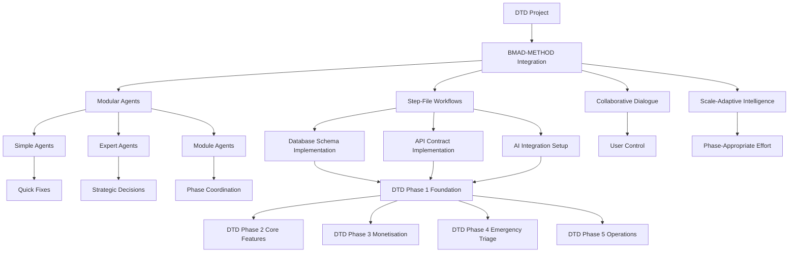

# BMAD-METHOD Integration Plan for Dog Trainers Directory (DTD)

**Project:** Dog Trainers Directory (DTD)  
**BMAD-METHOD Version:** 6.0.0-alpha.15  
**DTD Documentation Status:** All 15 architectural decisions locked, ready for development  
**Date:** 2025-12-25  
**Audience:** Product leads, architects, developers, operations team

---

## Table of Contents

1. [Executive Summary](#executive-summary)
2. [BMAD Module Selection and Rationale](#bmad-module-selection-and-rationale)
3. [DTD Phase-to-BMAD Agent Mapping](#dtd-phase-to-bmad-agent-mapping)
4. [Custom BMAD Agents for DTD](#custom-bmad-agents-for-dtd)
5. [BMAD Workflow Specifications](#bmad-workflow-specifications)
6. [BMAD Workspace Configuration for DTD](#bmad-workspace-configuration-for-dtd)
7. [Step-by-Step BMAD Integration Roadmap](#step-by-step-bmad-integration-roadmap)
8. [BMAD Integration Benefits for DTD](#bmad-integration-benefits-for-dtd)
9. [Risk Assessment and Mitigations](#risk-assessment-and-mitigations)
10. [Success Metrics](#success-metrics)

---

## Executive Summary

### Overview

BMAD-METHOD will be integrated into the Dog Trainers Directory (DTD) project to provide structured, AI-assisted development workflows that prevent context overflow, match task complexity to appropriate agent types, and maintain user control throughout implementation.

The integration leverages BMAD's core architectural innovations:
- **Step-File Architecture** to manage complex DTD workflows without context overflow
- **Modular Agent System** to match agent capabilities to DTD task complexity
- **Collaborative Dialogue Model** to ensure user control during implementation
- **Scale-Adaptive Intelligence** to adjust effort for each DTD phase

### Key Benefits for DTD

| Benefit | DTD-Specific Impact |
|----------|---------------------|
| **Context Overflow Prevention** | DTD has 10 core tables, 12 enum types, and complex AI integration logic. Step-file architecture ensures each development task focuses on relevant context only. |
| **Right-Sized AI for Each Task** | Simple agents for bug fixes (e.g., search ranking issues), Expert agents for architecture decisions (e.g., AI fallback strategy), Module agents for multi-phase coordination. |
| **User Control Throughout** | Collaborative dialogue model ensures operator maintains control over 4h/week workflow decisions. |
| **Efficient Resource Utilization** | Scale-adaptive intelligence matches effort to DTD's 5-phase implementation timeline. |

### High-Level Integration Architecture



---

## BMAD Module Selection and Rationale

### Recommended Modules for DTD

| Module | Install? | Rationale for DTD | Primary Use Cases |
|--------|-----------|-------------------|------------------|
| **BMB (BMAD Builder)** | ✅ Yes | Essential for creating DTD-specific custom agents and workflows | Create custom agents for database, API, AI workflows |
| **BMM (Business Method & Management)** | ✅ Yes | Useful for project planning and management across 5 DTD phases | Phase planning, milestone tracking, risk assessment |
| **CIS (Creativity & Innovation Suite)** | ⚠️ Optional | Helpful for brainstorming but less critical for locked architecture | Feature ideation, UX brainstorming (Phase 2+) |

### Module-Specific Integration Points

#### BMB (BMAD Builder) Integration

**Purpose:** Create DTD-specific agents and workflows

**Integration Points:**
1. **Custom Agent Creation** - Create agents specialized for DTD domains:
   - Database Schema Architect (for [`02_DOMAIN_MODEL.md`](DOCS/02_DOMAIN_MODEL.md:1) implementation)
   - API Contract Designer (for [`05_DATA_AND_API_CONTRACTS.md`](DOCS/05_DATA_AND_API_CONTRACTS.md:1) implementation)
   - AI Integration Specialist (for [`07_AI_AUTOMATION_AND_MODES.md`](DOCS/07_AI_AUTOMATION_AND_MODES.md:1) implementation)

2. **Custom Workflow Creation** - Create workflows for DTD implementation:
   - Database Schema Implementation Workflow
   - API Contract Implementation Workflow
   - AI Integration Setup Workflow

3. **Agent Editing** - Modify existing BMAD agents to understand DTD context:
   - Add DTD-specific knowledge to Project Strategist
   - Configure Quick Planner for DTD technology stack (Next.js 15, Supabase, Stripe)

#### BMM (Business Method & Management) Integration

**Purpose:** Project planning and management across DTD phases

**Integration Points:**
1. **Phase Planning** - Use BMM workflows to plan each DTD phase:
   - Phase 1: Foundation (Weeks 1-2)
   - Phase 2: Core Features (Weeks 3-4)
   - Phase 3: Monetisation (Weeks 5-6)
   - Phase 4: Emergency Triage (Weeks 7-8)
   - Phase 5: Operations (Weeks 9-10)

2. **Milestone Tracking** - Track progress against DTD success criteria from [`01_PRODUCT_OVERVIEW_COMPREHENSIVE.md`](DOCS/01_PRODUCT_OVERVIEW_COMPREHENSIVE.md:1)

3. **Risk Assessment** - Identify and mitigate risks specific to DTD:
   - AI provider dependency (Z.AI, OpenAI)
   - Stripe webhook reliability
   - 4h/week operator capacity

#### CIS (Creativity & Innovation Suite) Integration

**Purpose:** Brainstorming and ideation (Optional for Phase 1)

**Integration Points:**
1. **Feature Ideation** - Brainstorm Phase 2+ enhancements:
   - Pro tier subscription features
   - Advanced analytics dashboards
   - Mobile app concepts

2. **UX Brainstorming** - Improve user journeys from [`03_USER_JOURNEYS.md`](DOCS/03_USER_JOURNEYS.md:1)

**Note:** CIS is optional for Phase 1 as all 15 architectural decisions are locked. Recommended for Phase 2+ when exploring enhancements.

---

## DTD Phase-to-BMAD Agent Mapping

### Phase 1: Foundation (Weeks 1-2)

**Scope:** Project setup, database schema, authentication

| Task | BMAD Agent Type | Specific Agent | Justification | Expected Outcome |
|------|------------------|-----------------|---------------|------------------|
| Project initialization | Simple | Quick Planner | Quick decisions on project structure, tooling setup | Next.js 15 project initialized with BMAD integration |
| Database schema design | Expert | Project Strategist | Complex analysis of [`02_DOMAIN_MODEL.md`](DOCS/02_DOMAIN_MODEL.md:1) requirements | Database migration plan aligned with 10 core tables |
| Supabase setup | Simple | Quick Planner | Immediate decisions on Supabase configuration | Supabase project created, connection established |
| Authentication implementation | Expert | Project Strategist | Strategic analysis of D-013 (MFA requirements) | Email OTP + TOTP authentication implemented |

**Workflow:** Use BMB to create "Database Schema Implementation Workflow" (see Section 5), then execute with Project Strategist agent.

---

### Phase 2: Core Features (Weeks 3-4)

**Scope:** Trainer profiles, search & discovery, reviews

| Task | BMAD Agent Type | Specific Agent | Justification | Expected Outcome |
|------|------------------|-----------------|---------------|------------------|
| Trainer profile CRUD | Simple | Quick Planner | Straightforward CRUD operations | Trainer registration, profile management implemented |
| Search implementation | Expert | Project Strategist | Complex ranking algorithm (D-006) | Search with Featured→Verified→Distance→Rating ranking |
| Review system | Expert | Project Strategist | Moderation workflow with AI integration | Review submission, AI moderation, manual queue |
| User journey implementation | Module | Agile Master | Coordinate multiple user flows | Dog owner, trainer, emergency journeys complete |

**Workflow:** Use BMB to create "API Contract Implementation Workflow" (see Section 5), then execute with Agile Master agent.

---

### Phase 3: Monetisation (Weeks 5-6)

**Scope:** Stripe integration, featured placements

| Task | BMAD Agent Type | Specific Agent | Justification | Expected Outcome |
|------|------------------|-----------------|---------------|------------------|
| Stripe Checkout integration | Expert | Project Strategist | Complex payment flow with webhooks | Stripe Checkout session creation, webhook handling |
| Featured placement logic | Expert | Project Strategist | Queue management, expiry, promotion (D-002) | Featured placement system with FIFO queue |
| Refund handling | Simple | Quick Planner | Straightforward refund logic | 3-day refund window enforcement |
| Payment audit logging | Simple | Quick Planner | Immutable audit trail (D-012) | payment_audit table with idempotency |

**Workflow:** Use BMB to create "Monetisation Implementation Workflow" (custom workflow), then execute with Project Strategist agent.

---

### Phase 4: Emergency Triage (Weeks 7-8)

**Scope:** AI integration, triage workflow

| Task | BMAD Agent Type | Specific Agent | Justification | Expected Outcome |
|------|------------------|-----------------|---------------|------------------|
| Z.AI integration | Expert | AI Integration Specialist | Complex AI integration with fallback logic | Z.AI primary, OpenAI fallback, deterministic rules |
| Triage classification | Expert | AI Integration Specialist | Multi-tier classification (D-001, D-007) | Medical/crisis/stray/normal classification with confidence scores |
| Emergency resource lookup | Simple | Quick Planner | Database query for emergency contacts | Emergency vets, shelters displayed by council |
| Triage logging | Simple | Quick Planner | Audit trail for all triage events | triage_logs table populated |

**Workflow:** Use BMB to create "AI Integration Setup Workflow" (see Section 5), then execute with AI Integration Specialist agent.

---

### Phase 5: Operations (Weeks 9-10)

**Scope:** Admin dashboard, monitoring

| Task | BMAD Agent Type | Specific Agent | Justification | Expected Outcome |
|------|------------------|-----------------|---------------|------------------|
| Admin dashboard UI | Simple | Quick Planner | Straightforward dashboard components | Red alerts, manual review queue, payment audit |
| Operator workflow | Module | Agile Master | Coordinate 4h/week operations (D-010) | Pull-based operator workflow implemented |
| Health monitoring | Simple | Quick Planner | Health checks for AI, Stripe, DB | Automated health alerts to operator |
| Incident response | Expert | Project Strategist | Playbook-based incident handling | Documented response procedures for common scenarios |

**Workflow:** Use BMB to create "Operations Implementation Workflow" (custom workflow), then execute with Agile Master agent.

---

## Custom BMAD Agents for DTD

### Agent 1: Database Schema Architect

**Agent Type:** Expert (Persistent Memory)

**Primary Purpose and Responsibilities:**

Specializes in implementing DTD database schema as specified in [`02_DOMAIN_MODEL.md`](DOCS/02_DOMAIN_MODEL.md:1). Responsible for:

- Creating migration files for all 10 core tables
- Implementing enum types (12 enums: dog_age_group, dog_behavior_issue, dog_service_type, etc.)
- Setting up foreign key relationships and constraints
- Implementing RLS (Row Level Security) policies
- Creating indexes for performance optimization
- Seeding reference data (28 councils, 200+ suburbs)

**Memory Requirements:** Persistent

- Remembers previous migration decisions
- Tracks schema evolution across DTD phases
- Stores performance optimization patterns
- Maintains data integrity rules (invariants from [`02_DOMAIN_MODEL.md`](DOCS/02_DOMAIN_MODEL.md:939))

**Key Workflows:**

1. **Migration Creation Workflow**
   - Generate Supabase migration SQL
   - Apply migrations in correct order (enums → tables → indexes → triggers)
   - Verify migration success

2. **RLS Policy Workflow**
   - Define RLS policies for each table
   - Implement trainer-only access to their listings
   - Implement admin-only access to sensitive operations

3. **Data Seeding Workflow**
   - Load 28 councils from seed data
   - Load 200+ suburbs from CSV
   - Verify referential integrity

**Integration Points with Existing BMAD Agents:**

- **Project Strategist:** Provides strategic context for schema decisions
- **Quick Planner:** Handles immediate schema fix tasks
- **Agile Master:** Coordinates schema changes across development team

---

### Agent 2: API Contract Designer

**Agent Type:** Expert (Persistent Memory)

**Primary Purpose and Responsibilities:**

Specializes in creating and validating API contracts as specified in [`05_DATA_AND_API_CONTRACTS.md`](DOCS/05_DATA_AND_API_CONTRACTS.md:1). Responsible for:

- Designing REST API endpoints for all DTD operations
- Defining request/response schemas with TypeScript types
- Implementing validation logic (Zod or similar)
- Creating API documentation (OpenAPI/Swagger)
- Setting up authentication middleware (D-013: MFA)
- Implementing rate limiting and error handling

**Memory Requirements:** Persistent

- Remembers API design patterns used across DTD
- Tracks endpoint evolution and versioning
- Stores common validation rules
- Maintains security best practices

**Key Workflows:**

1. **Endpoint Design Workflow**
   - Define endpoint path, method, parameters
   - Specify request body schema
   - Specify response schema (success, error cases)
   - Document authentication requirements

2. **Validation Implementation Workflow**
   - Create TypeScript types for all DTOs
   - Implement Zod schemas for runtime validation
   - Add custom validators (e.g., ABN format, suburb validation)

3. **Authentication Middleware Workflow**
   - Implement JWT verification for trainer routes
   - Implement TOTP verification for admin routes
   - Implement email OTP verification for registration

**Integration Points with Existing BMAD Agents:**

- **Project Strategist:** Provides strategic context for API architecture
- **Quick Planner:** Handles immediate API bug fixes
- **Agile Master:** Coordinates API changes across frontend/backend teams

---

### Agent 3: AI Integration Specialist

**Agent Type:** Expert (Persistent Memory)

**Primary Purpose and Responsibilities:**

Specializes in implementing AI integration as specified in [`07_AI_AUTOMATION_AND_MODES.md`](DOCS/07_AI_AUTOMATION_AND_MODES.md:1). Responsible for:

- Implementing Z.AI integration (primary tier)
- Implementing OpenAI fallback (secondary tier)
- Implementing deterministic keyword matching (final fallback)
- Setting up feature flags for AI mode switching
- Implementing confidence threshold logic (D-008)
- Creating health monitoring for AI providers
- Logging all AI decisions to audit tables

**Memory Requirements:** Persistent

- Remembers AI provider performance patterns
- Tracks fallback trigger conditions
- Stores confidence threshold tuning history
- Maintains cost optimization strategies

**Key Workflows:**

1. **Z.AI Integration Workflow**
   - Configure Z.AI API client
   - Implement triage classification endpoint
   - Implement review moderation endpoint
   - Set up timeout and retry logic

2. **Fallback Implementation Workflow**
   - Implement OpenAI client as fallback
   - Implement deterministic keyword classifier
   - Create cascade logic (Z.AI → OpenAI → Deterministic)
   - Set up feature flags for mode switching

3. **Health Monitoring Workflow**
   - Implement health check endpoints for each provider
   - Track failure rates and response times
   - Alert operator when Z.AI down >30 min
   - Log all AI decisions to triage_logs and review_moderation_logs

**Integration Points with Existing BMAD Agents:**

- **Project Strategist:** Provides strategic context for AI architecture decisions
- **Quick Planner:** Handles immediate AI bug fixes
- **Agile Master:** Coordinates AI integration across backend team

---

## BMAD Workflow Specifications

### Workflow 1: Database Schema Implementation

**Purpose:** Implement DTD database schema from [`02_DOMAIN_MODEL.md`](DOCS/02_DOMAIN_MODEL.md:1) using step-file architecture

**Step File Structure:**

```
.bmad/workflows/database-schema-implementation/
├── workflow.md                          # Main workflow entry point
└── steps/
    ├── step-01-enums-creation.md
    ├── step-02-core-tables-creation.md
    ├── step-03-foreign-keys-constraints.md
    ├── step-04-indexes-creation.md
    ├── step-05-rls-policies.md
    ├── step-06-triggers-creation.md
    ├── step-07-seed-councils.md
    ├── step-08-seed-suburbs.md
    └── step-09-verification.md
```

**Mandatory Rules:**

- 🛑 **NEVER generate SQL without user input**
- 📋 **YOU ARE A FACILITATOR**, not a code generator
- ⏸️ **ALWAYS halt at menus and wait for input**
- 📖 **Reference [`02_DOMAIN_MODEL.md`](DOCS/02_DOMAIN_MODEL.md:1) for all schema decisions**
- 🔒 **Enforce all data integrity rules** (invariants from Section 939)

**Step 1: Enums Creation**

**Goal:** Create all 12 enum types

**Execution:**
```
## STEP GOAL: Create enum types for DTD database

## MANDATORY RULES
- 🛑 NEVER generate SQL without user input
- 📋 YOU ARE A FACILITATOR, not a code generator
- ⏸️ ALWAYS halt at menus and wait for input

## EXECUTION
I'll guide you through creating enum types one by one.

Enums to create (from 02_DOMAIN_MODEL.md):
1. dog_age_group (5 values)
2. dog_behavior_issue (13 values)
3. dog_service_type (5 values)
4. dog_business_resource_type (5 values)
5. review_moderation_status (3 values)
6. featured_placement_status (5 values)
7. dog_triage_classification (4 values)

## MENU
[E] Create all enums at once
[P] Create enums one-by-one with review
[C] Continue to next step
[R] Revise enum definitions
```

**Expected User Inputs:**
- Choice between creating all enums at once or one-by-one
- Confirmation of enum values before SQL generation
- Any custom enum values (if deviating from spec)

---

**Step 2: Core Tables Creation**

**Goal:** Create 10 core tables

**Execution:**
```
## STEP GOAL: Create core database tables

## MANDATORY RULES
- 🛑 NEVER generate SQL without user input
- 📋 YOU ARE A FACILITATOR, not a code generator
- ⏸️ ALWAYS halt at menus and wait for input

## EXECUTION
Tables to create (from 02_DOMAIN_MODEL.md):
1. councils (28 rows)
2. localities (200+ rows)
3. users (trainer accounts)
4. businesses (trainer listings)
5. reviews (user reviews)
6. featured_placements (monetisation audit)
7. payment_audit (Stripe webhook log)
8. emergency_contacts (cached emergency resources)
9. triage_logs (emergency triage audit)
10. cron_jobs (scheduled task audit)

## MENU
[E] Create all tables at once
[P] Create tables one-by-one with review
[C] Continue to next step
[R] Revise table definitions
```

**Expected User Inputs:**
- Choice between creating all tables at once or one-by-one
- Confirmation of table structure before SQL generation
- Any custom table modifications (if deviating from spec)

---

**Step 3: Foreign Keys & Constraints**

**Goal:** Define relationships and data integrity rules

**Execution:**
```
## STEP GOAL: Define foreign keys and constraints

## MANDATORY RULES
- 🛑 NEVER generate SQL without user input
- 📋 YOU ARE A FACILITATOR, not a code generator
- ⏸️ ALWAYS halt at menus and wait for input

## EXECUTION
Foreign keys to define (from 02_DOMAIN_MODEL.md):
- localities.council_id → councils.id
- businesses.user_id → users.id
- businesses.locality_id → localities.id
- businesses.council_id → councils.id
- reviews.business_id → businesses.id
- featured_placements.business_id → businesses.id
- featured_placements.council_id → councils.id
- emergency_contacts.business_id → businesses.id
- payment_audit.business_id → businesses.id

Constraints to enforce:
- Trainer age specialties required (Rule 2)
- Emergency resources require emergency phone (Rule 3)
- ABN format validation (Rule 6)
- Trainer names not empty (Rule 8)

## MENU
[E] Create all FKs and constraints at once
[P] Create one-by-one with review
[C] Continue to next step
[R] Revise constraint definitions
```

**Expected User Inputs:**
- Confirmation of foreign key relationships
- Choice of cascade behavior (RESTRICT, CASCADE, SET NULL)
- Any additional constraints beyond spec

---

### Workflow 2: API Contract Implementation

**Purpose:** Implement API contracts from [`05_DATA_AND_API_CONTRACTS.md`](DOCS/05_DATA_AND_API_CONTRACTS.md:1) using step-file architecture

**Step File Structure:**

```
.bmad/workflows/api-contract-implementation/
├── workflow.md                          # Main workflow entry point
└── steps/
    ├── step-01-endpoint-design.md
    ├── step-02-typescript-types.md
    ├── step-03-validation-schemas.md
    ├── step-04-authentication-middleware.md
    ├── step-05-error-handling.md
    ├── step-06-rate-limiting.md
    └── step-07-documentation.md
```

**Mandatory Rules:**

- 🛑 **NEVER generate TypeScript without user input**
- 📋 **YOU ARE A FACILITATOR**, not a code generator
- ⏸️ **ALWAYS halt at menus and wait for input**
- 📖 **Reference [`05_DATA_AND_API_CONTRACTS.md`](DOCS/05_DATA_AND_API_CONTRACTS.md:1) for all API specifications**
- 🔒 **Enforce D-013 (MFA) for all protected routes**

**Step 1: Endpoint Design**

**Goal:** Design REST API endpoints

**Execution:**
```
## STEP GOAL: Design REST API endpoints for DTD

## MANDATORY RULES
- 🛑 NEVER generate endpoint specs without user input
- 📋 YOU ARE A FACILITATOR, not a code generator
- ⏸️ ALWAYS halt at menus and wait for input

## EXECUTION
Endpoint categories to design:
1. Public endpoints (dog owner search, emergency triage)
2. Trainer endpoints (registration, profile management, featured purchase)
3. Admin endpoints (dashboard, manual review, operations)

## MENU
[E] Design all endpoints at once
[P] Design by category with review
[C] Continue to next step
[R] Revise endpoint definitions
```

**Expected User Inputs:**
- Choice between designing all endpoints at once or by category
- Confirmation of HTTP methods (GET, POST, PUT, DELETE)
- Any custom endpoints beyond spec

---

**Step 2: TypeScript Types**

**Goal:** Create TypeScript types for all DTOs

**Execution:**
```
## STEP GOAL: Create TypeScript types for API contracts

## MANDATORY RULES
- 🛑 NEVER generate TypeScript without user input
- 📋 YOU ARE A FACILITATOR, not a code generator
- ⏸️ ALWAYS halt at menus and wait for input

## EXECUTION
Type categories to create:
1. Request DTOs (CreateTrainerRequest, SearchRequest, etc.)
2. Response DTOs (TrainerResponse, SearchResponse, etc.)
3. Domain types (enums, entities)
4. Error types (ApiError, ValidationError, etc.)

## MENU
[E] Create all types at once
[P] Create by category with review
[C] Continue to next step
[R] Revise type definitions
```

**Expected User Inputs:**
- Confirmation of type structure
- Choice between interfaces vs types
- Any custom types beyond spec

---

### Workflow 3: AI Integration Setup

**Purpose:** Implement AI integration from [`07_AI_AUTOMATION_AND_MODES.md`](DOCS/07_AI_AUTOMATION_AND_MODES.md:1) using step-file architecture

**Step File Structure:**

```
.bmad/workflows/ai-integration-setup/
├── workflow.md                          # Main workflow entry point
└── steps/
    ├── step-01-z-ai-client.md
    ├── step-02-openai-fallback.md
    ├── step-03-deterministic-rules.md
    ├── step-04-cascade-logic.md
    ├── step-05-feature-flags.md
    ├── step-06-health-monitoring.md
    ├── step-07-audit-logging.md
    └── step-08-testing-validation.md
```

**Mandatory Rules:**

- 🛑 **NEVER generate integration code without user input**
- 📋 **YOU ARE A FACILITATOR**, not a code generator
- ⏸️ **ALWAYS halt at menus and wait for input**
- 📖 **Reference [`07_AI_AUTOMATION_AND_MODES.md`](DOCS/07_AI_AUTOMATION_AND_MODES.md:1) for all AI specifications**
- 🔒 **Enforce D-007 (fallback rules) and D-008 (confidence thresholds)**

**Step 1: Z.AI Client Setup**

**Goal:** Configure Z.AI integration

**Execution:**
```
## STEP GOAL: Configure Z.AI client for DTD

## MANDATORY RULES
- 🛑 NEVER generate client code without user input
- 📋 YOU ARE A FACILITATOR, not a code generator
- ⏸️ ALWAYS halt at menus and wait for input

## EXECUTION
Z.AI configuration (from 07_AI_AUTOMATION_AND_MODES.md):
- Endpoint: https://api.z.ai/v1/classify
- Model: dog-behavior-classifier-v1
- Timeout: 5 seconds
- Confidence threshold: 0.85

Use cases:
1. Emergency triage classification
2. Review moderation (spam detection)

## MENU
[E] Configure all Z.AI use cases at once
[P] Configure by use case with review
[C] Continue to next step
[R] Revise Z.AI configuration
```

**Expected User Inputs:**
- Confirmation of Z.AI API key configuration
- Choice between configuring all use cases or one-by-one
- Any custom timeout or threshold values

---

**Step 2: OpenAI Fallback**

**Goal:** Configure OpenAI as fallback

**Execution:**
```
## STEP GOAL: Configure OpenAI fallback for DTD

## MANDATORY RULES
- 🛑 NEVER generate client code without user input
- 📋 YOU ARE A FACILITATOR, not a code generator
- ⏸️ ALWAYS halt at menus and wait for input

## EXECUTION
OpenAI configuration (from 07_AI_AUTOMATION_AND_MODES.md):
- Model: gpt-4-turbo
- Timeout: 10 seconds
- Trigger: Z.AI fails >5 min OR timeout
- Cost budget: <$50/month

Fallback logic:
1. Try Z.AI (5s timeout)
2. If fails → Try OpenAI (10s timeout)
3. If fails → Use deterministic rules

## MENU
[E] Configure OpenAI fallback now
[P] Review fallback trigger conditions
[C] Continue to next step
[R] Revise OpenAI configuration
```

**Expected User Inputs:**
- Confirmation of OpenAI API key configuration
- Agreement on fallback trigger conditions
- Any custom fallback logic beyond spec

---

**Step 3: Deterministic Rules**

**Goal:** Implement keyword-based fallback

**Execution:**
```
## STEP GOAL: Implement deterministic keyword matching

## MANDATORY RULES
- 🛑 NEVER generate keyword rules without user input
- 📋 YOU ARE A FACILITATOR, not a code generator
- ⏸️ ALWAYS halt at menus and wait for input

## EXECUTION
Deterministic rules (from 07_AI_AUTOMATION_AND_MODES.md):
Medical keywords: bleeding, blood, injury, poisoned, choking, etc.
Crisis keywords: attacking, fighting, loose, out of control, etc.
Stray keywords: found, loose, unknown, stray, lost, etc.
Default: normal classification

Confidence scores:
- Keywords matched: 0.95
- Default to normal: 0.80

## MENU
[E] Implement all keyword categories at once
[P] Implement by category with review
[C] Continue to next step
[R] Revise keyword definitions
```

**Expected User Inputs:**
- Confirmation of keyword lists
- Any additional keywords beyond spec
- Agreement on confidence scores

---

## BMAD Workspace Configuration for DTD

### Recommended BMAD Folder Structure

```
dogtrainersdirectory/
├── .bmad/                                    # BMAD installation directory
│   ├── config.yaml                            # Core BMAD configuration
│   ├── agents/                                # Agent definitions
│   │   ├── simple/                            # Simple (stateless) agents
│   │   │   └── quick-planner.agent.yaml
│   │   ├── expert/                            # Expert (persistent memory) agents
│   │   │   ├── project-strategist.agent.yaml
│   │   │   └── [DTD CUSTOM AGENTS]
│   │   │       ├── database-schema-architect.agent.yaml
│   │   │       ├── api-contract-designer.agent.yaml
│   │   │       └── ai-integration-specialist.agent.yaml
│   │   └── module/                           # Module (orchestration) agents
│   │       └── agile-master.agent.yaml
│   ├── workflows/                             # Step-file workflows
│   │   ├── planning/                          # Planning workflows
│   │   │   ├── project-planning-workflow.md
│   │   │   └── steps/
│   │   ├── [DTD CUSTOM WORKFLOWS]
│   │   │   ├── database-schema-implementation/
│   │   │   │   ├── workflow.md
│   │   │   │   └── steps/
│   │   │   │       ├── step-01-enums-creation.md
│   │   │   │       ├── step-02-core-tables-creation.md
│   │   │   │       └── ...
│   │   │   ├── api-contract-implementation/
│   │   │   │   ├── workflow.md
│   │   │   │   └── steps/
│   │   │   │       ├── step-01-endpoint-design.md
│   │   │   │       └── ...
│   │   │   └── ai-integration-setup/
│   │   │       ├── workflow.md
│   │   │       └── steps/
│   │   │           ├── step-01-z-ai-client.md
│   │   │           └── ...
│   │   └── quality/                           # Quality assurance workflows
│   │       └── plan-validation-workflow.md
│   └── modules/                               # Installed modules
│       ├── bmb/                               # BMAD Builder module
│       │   ├── module.yaml
│       │   ├── agents/
│       │   ├── workflows/
│       │   │   ├── create-agent/
│       │   │   ├── create-workflow/
│       │   │   ├── edit-agent/
│       │   │   └── edit-workflow/
│       │   └── docs/
│       └── bmm/                               # Business Method module
│           ├── module.yaml
│           ├── agents/
│           └── workflows/
│
├── .bmad-user-memory/                        # Agent sidecar content (gitignored)
│   ├── quick-planner-sidecar/
│   ├── project-strategist-sidecar/
│   ├── database-schema-architect-sidecar/
│   ├── api-contract-designer-sidecar/
│   ├── ai-integration-specialist-sidecar/
│   └── agile-master-sidecar/
│
├── .kilocodemodes/                           # Kilocode mode definitions
│   ├── bmad-bmb-bmad-builder.md
│   ├── bmad-core-bmad-master.md
│   ├── bmad-core-project-strategist.md
│   ├── bmad-core-quick-planner.md
│   ├── bmad-core-agile-master.md
│   ├── dtd-database-schema-architect.md
│   ├── dtd-api-contract-designer.md
│   └── dtd-ai-integration-specialist.md
│
├── docs/                                      # AI-generated artifacts
│   ├── project-plans/
│   ├── architecture/
│   ├── api-contracts/
│   ├── database-schemas/
│   └── ai-integration/
│
├── DOCS/                                     # DTD documentation (existing)
│   ├── 01_PRODUCT_OVERVIEW_COMPREHENSIVE.md
│   ├── 02_DOMAIN_MODEL.md
│   ├── 03_USER_JOURNEYS.md
│   ├── 04_ROUTES_AND_NAVIGATION.md
│   ├── 05_DATA_AND_API_CONTRACTS.md
│   ├── 06_MONETISATION_AND_FEATURED_PLACEMENT.md
│   ├── 07_AI_AUTOMATION_AND_MODES.md
│   ├── 08_OPERATIONS_AND_HEALTH.md
│   ├── 09_SECURITY_AND_PRIVACY.md
│   └── SPECIFICATIONS_MANIFEST.md
│
├── src/                                       # Next.js 15 application code
│   ├── app/
│   ├── components/
│   ├── lib/
│   └── ...
│
├── supabase/                                  # Supabase migrations and functions
│   ├── migrations/
│   └── functions/
│
├── .vscode/                                   # VSCode configuration
│   └── settings.json
│
├── .gitignore
├── package.json
├── tsconfig.json
└── README.md
```

### Agent Sidecar Memory Folder Configuration

**Configuration in `.bmad/config.yaml`:**

```yaml
# BMAD Core Configuration for DTD
header: "BMAD Core Configuration - DTD Project"
subheader: "Configure core settings for DTD-specific BMAD installation"

bmad_folder:
  prompt: "What is root folder for BMAD installation?"
  default: ".bmad"
  result: "{value}"

user_name:
  prompt: "What shall agents call you?"
  default: "DTD Developer"
  result: "{value}"

communication_language:
  prompt: "Preferred Chat Language/Style?"
  default: "English"
  result: "{value}"

agent_sidecar_folder:
  prompt: "Where should users' agent sidecar memory folders be stored?"
  default: ".bmad-user-memory"
  result: "{project-root}/{value}"

output_folder:
  prompt: "Where should AI Generated Artifacts be saved across all modules?"
  default: "docs"
  result: "{project-root}/{value}"

# DTD-specific configuration
dtd_project_context:
  documentation_path: "DOCS/"
  technology_stack:
    - "Next.js 15"
    - "TypeScript"
    - "Tailwind CSS"
    - "Supabase (Postgres 15)"
    - "Stripe"
    - "Z.AI"
    - "OpenAI"
    - "Vercel"
  architectural_decisions_locked: true
  total_decisions: 15
```

### AI-Generated Artifacts Folder Structure

**Aligned with DTD documentation:**

```
docs/
├── project-plans/
│   ├── phase-1-foundation-plan.md
│   ├── phase-2-core-features-plan.md
│   ├── phase-3-monetisation-plan.md
│   ├── phase-4-emergency-triage-plan.md
│   └── phase-5-operations-plan.md
│
├── architecture/
│   ├── database-architecture.md
│   ├── api-architecture.md
│   ├── ai-architecture.md
│   └── deployment-architecture.md
│
├── api-contracts/
│   ├── public-endpoints.md
│   ├── trainer-endpoints.md
│   ├── admin-endpoints.md
│   └── typescript-types.md
│
├── database-schemas/
│   ├── migrations-plan.md
│   ├── rls-policies.md
│   └── seed-data-plan.md
│
└── ai-integration/
    ├── z-ai-configuration.md
    ├── openai-fallback-configuration.md
    ├── deterministic-rules.md
    └── health-monitoring-plan.md
```

### VSCode/Kilocode Configuration Specific to DTD

**`.vscode/settings.json`:**

```json
{
  "editor.formatOnSave": true,
  "editor.defaultFormatter": "esbenp.prettier-vscode",
  "editor.codeActionsOnSave": {
    "source.fixAll.eslint": "explicit"
  },
  "files.exclude": {
    "**/.bmad-user-memory": true,
    "**/.planner-memory": true
  },
  "search.exclude": {
    "**/.bmad-user-memory": true,
    "**/.planner-memory": true,
    "**/.bmad": true
  },
  "kilocode.modesPath": ".kilocodemodes",
  "kilocode.autoLoadModes": true,
  
  // DTD-specific settings
  "typescript.tsdk": "node20",
  "tailwindCSS.experimental.classRegex": "^(dog|trainer|emergency|review|featured|admin|operator)",
  "files.associations": {
    "*.sql": "sql",
    "*.supabase-migration": "sql"
  }
}
```

**`.gitignore` additions:**

```gitignore
# BMAD-METHOD
.bmad-user-memory/
.planner-memory/

# DTD-specific
.env.local
.env.production
supabase/.env.local
```

---

## Step-by-Step BMAD Integration Roadmap

### Phase 1: BMAD Installation and Configuration

**Step 1.1: Install BMAD-METHOD**

**BMAD Agent:** Quick Planner (Simple)

**Workflow:** BMAD installation workflow (built-in)

**Expected Outcomes:**
- BMAD-METHOD 6.0.0-alpha.15 installed globally
- `.bmad/` directory structure created
- `.kilocodemodes/` mode files generated

**Dependencies:** None

---

**Step 1.2: Configure BMAD for DTD**

**BMAD Agent:** Quick Planner (Simple)

**Workflow:** BMAD configuration workflow (built-in)

**Expected Outcomes:**
- `.bmad/config.yaml` configured with DTD-specific settings
- Agent sidecar folder set to `.bmad-user-memory/`
- Output folder set to `docs/`
- DTD documentation path configured

**Dependencies:** Step 1.1 complete

---

**Step 1.3: Install BMAD Modules**

**BMAD Agent:** Quick Planner (Simple)

**Workflow:** BMAD module selection workflow (built-in)

**Expected Outcomes:**
- BMB (BMAD Builder) module installed
- BMM (Business Method & Management) module installed
- CIS (Creativity & Innovation Suite) optional (deferred to Phase 2+)

**Dependencies:** Step 1.2 complete

---

### Phase 2: Custom Agent Creation (Using BMB)

**Step 2.1: Create Database Schema Architect Agent**

**BMAD Agent:** BMAD Builder (Module)

**Workflow:** BMB create-agent workflow

**Expected Outcomes:**
- `database-schema-architect.agent.yaml` created in `.bmad/agents/expert/`
- Agent configured with Expert type (persistent memory)
- Agent specialized in DTD database schema from [`02_DOMAIN_MODEL.md`](DOCS/02_DOMAIN_MODEL.md:1)
- Sidecar folder configured: `.bmad-user-memory/database-schema-architect-sidecar/`
- Kilocode mode file generated: `dtd-database-schema-architect.md`

**Dependencies:** Phase 1 complete

---

**Step 2.2: Create API Contract Designer Agent**

**BMAD Agent:** BMAD Builder (Module)

**Workflow:** BMB create-agent workflow

**Expected Outcomes:**
- `api-contract-designer.agent.yaml` created in `.bmad/agents/expert/`
- Agent configured with Expert type (persistent memory)
- Agent specialized in DTD API contracts from [`05_DATA_AND_API_CONTRACTS.md`](DOCS/05_DATA_AND_API_CONTRACTS.md:1)
- Sidecar folder configured: `.bmad-user-memory/api-contract-designer-sidecar/`
- Kilocode mode file generated: `dtd-api-contract-designer.md`

**Dependencies:** Step 2.1 complete

---

**Step 2.3: Create AI Integration Specialist Agent**

**BMAD Agent:** BMAD Builder (Module)

**Workflow:** BMB create-agent workflow

**Expected Outcomes:**
- `ai-integration-specialist.agent.yaml` created in `.bmad/agents/expert/`
- Agent configured with Expert type (persistent memory)
- Agent specialized in DTD AI integration from [`07_AI_AUTOMATION_AND_MODES.md`](DOCS/07_AI_AUTOMATION_AND_MODES.md:1)
- Sidecar folder configured: `.bmad-user-memory/ai-integration-specialist-sidecar/`
- Kilocode mode file generated: `dtd-ai-integration-specialist.md`

**Dependencies:** Step 2.2 complete

---

### Phase 3: Workflow Development (Using BMB)

**Step 3.1: Create Database Schema Implementation Workflow**

**BMAD Agent:** BMAD Builder (Module)

**Workflow:** BMB create-workflow workflow

**Expected Outcomes:**
- `database-schema-implementation/workflow.md` created in `.bmad/workflows/`
- Step files created (step-01 through step-09)
- Workflow configured with Database Schema Architect agent
- Mandatory rules enforced (facilitator role, no assumptions, explicit consent)

**Dependencies:** Step 2.1 complete

---

**Step 3.2: Create API Contract Implementation Workflow**

**BMAD Agent:** BMAD Builder (Module)

**Workflow:** BMB create-workflow workflow

**Expected Outcomes:**
- `api-contract-implementation/workflow.md` created in `.bmad/workflows/`
- Step files created (step-01 through step-07)
- Workflow configured with API Contract Designer agent
- Mandatory rules enforced (facilitator role, no assumptions, explicit consent)

**Dependencies:** Step 2.2 complete

---

**Step 3.3: Create AI Integration Setup Workflow**

**BMAD Agent:** BMAD Builder (Module)

**Workflow:** BMB create-workflow workflow

**Expected Outcomes:**
- `ai-integration-setup/workflow.md` created in `.bmad/workflows/`
- Step files created (step-01 through step-08)
- Workflow configured with AI Integration Specialist agent
- Mandatory rules enforced (facilitator role, no assumptions, explicit consent)

**Dependencies:** Step 2.3 complete

---

### Phase 4: Project Execution (Using Appropriate Agents for Each DTD Phase)

**Step 4.1: Execute DTD Phase 1 (Foundation)**

**BMAD Agent:** Project Strategist (Expert) + Agile Master (Module)

**Workflow:** Database Schema Implementation Workflow (from Step 3.1)

**Expected Outcomes:**
- All 12 enum types created in Supabase
- All 10 core tables created with proper structure
- Foreign keys and constraints implemented
- RLS policies defined (trainer-only, admin-only)
- 28 councils seeded
- 200+ suburbs seeded from CSV
- Migration files committed to `supabase/migrations/`

**Dependencies:** Phase 3 complete

---

**Step 4.2: Execute DTD Phase 2 (Core Features)**

**BMAD Agent:** Agile Master (Module)

**Workflow:** API Contract Implementation Workflow (from Step 3.2)

**Expected Outcomes:**
- All public endpoints implemented (search, emergency triage)
- All trainer endpoints implemented (registration, profile management)
- All admin endpoints implemented (dashboard, manual review)
- TypeScript types created for all DTOs
- Validation schemas implemented (Zod)
- Authentication middleware implemented (D-013: MFA)
- API documentation generated (OpenAPI/Swagger)

**Dependencies:** Step 4.1 complete

---

**Step 4.3: Execute DTD Phase 3 (Monetisation)**

**BMAD Agent:** Project Strategist (Expert)

**Workflow:** Custom Monetisation Implementation Workflow (create in Step 3.4)

**Expected Outcomes:**
- Stripe Checkout integration implemented
- Webhook handler implemented (charge.succeeded, charge.refunded)
- Featured placement logic implemented (FIFO queue, max 5 per council)
- Refund handling implemented (3-day window)
- Payment audit logging implemented (immutable, idempotent)
- Cron job configured (featured expiry and promotion at 2am)

**Dependencies:** Step 4.2 complete

---

**Step 4.4: Execute DTD Phase 4 (Emergency Triage)**

**BMAD Agent:** AI Integration Specialist (Expert)

**Workflow:** AI Integration Setup Workflow (from Step 3.3)

**Expected Outcomes:**
- Z.AI client configured and tested
- OpenAI fallback configured
- Deterministic keyword classifier implemented
- Cascade logic implemented (Z.AI → OpenAI → Deterministic)
- Feature flags implemented (AI_ENABLED, AI_MODE, thresholds)
- Health monitoring implemented (provider health checks)
- Audit logging implemented (triage_logs, review_moderation_logs)
- All 80 test scenarios validated (20 per classification)

**Dependencies:** Step 4.3 complete

---

**Step 4.5: Execute DTD Phase 5 (Operations)**

**BMAD Agent:** Agile Master (Module)

**Workflow:** Custom Operations Implementation Workflow (create in Step 3.5)

**Expected Outcomes:**
- Admin dashboard UI implemented (red alerts, manual review queue)
- Operator workflow implemented (4h/week, pull-based)
- Health monitoring implemented (AI, Stripe, DB)
- Incident response playbooks documented
- Cron job health checks implemented
- Operator training materials created

**Dependencies:** Step 4.4 complete

---

### Phase 5: Validation and Handoff

**Step 5.1: Validate All DTD Decisions**

**BMAD Agent:** Project Strategist (Expert)

**Workflow:** Custom validation workflow

**Expected Outcomes:**
- All 15 architectural decisions verified against implementation
- Data integrity rules validated (from [`02_DOMAIN_MODEL.md`](DOCS/02_DOMAIN_MODEL.md:939))
- AI fallback rules validated (D-007)
- Confidence thresholds validated (D-008)
- MFA implementation validated (D-013)
- Key rotation plan validated (D-014)

**Dependencies:** Phase 4 complete

---

**Step 5.2: Generate Final Documentation**

**BMAD Agent:** Project Strategist (Expert)

**Workflow:** Documentation generation workflow

**Expected Outcomes:**
- Complete API documentation generated
- Database schema documentation generated
- AI integration documentation generated
- Operations playbooks generated
- Deployment guide generated
- All artifacts saved to `docs/` folder

**Dependencies:** Step 5.1 complete

---

## BMAD Integration Benefits for DTD

### How BMAD's Step-File Architecture Prevents Context Overflow

**DTD Challenge:**

DTD has significant complexity:
- 10 core tables with complex relationships
- 12 enum types with specific values
- Multi-tier AI integration (Z.AI → OpenAI → Deterministic)
- 5 implementation phases with interdependencies
- 15 locked architectural decisions to enforce

**BMAD Solution:**

Step-file architecture loads only the current step into memory, preventing context overflow:

| DTD Task | Without BMAD | With BMAD Step-File |
|------------|---------------|----------------------|
| Database schema implementation | All 10 tables + enums + constraints in context | Only current table/enum in context |
| AI integration | All 3 tiers + health monitoring + audit logging in context | Only current tier (Z.AI, OpenAI, or Deterministic) in context |
| API contract implementation | All endpoints + types + validation + auth in context | Only current endpoint category in context |

**Example: Database Schema Implementation**

Without BMAD:
```
Context includes:
- All 10 table definitions (councils, localities, users, businesses, reviews, featured_placements, payment_audit, emergency_contacts, triage_logs, cron_jobs)
- All 12 enum definitions
- All foreign key relationships
- All constraints and indexes
- All RLS policies
- All seed data

Result: Context overflow, AI loses focus, errors increase
```

With BMAD Step-File:
```
Step 1: Enums Creation
Context includes:
- Only enum definitions (12 enums)
- Enum values and constraints
- Migration SQL for enums

Step 2: Core Tables Creation
Context includes:
- Only table definitions (10 tables)
- Table columns and types
- Migration SQL for tables

Result: Focused context, higher accuracy, fewer errors
```

---

### How the Modular Agent System Matches Task Complexity

**DTD Task Complexity Analysis:**

| Task Complexity | DTD Example | BMAD Agent Type | Rationale |
|----------------|---------------|------------------|-----------|
| **Simple** (Immediate, <1 day) | Fix search ranking bug, add suburb validation | Simple (Quick Planner) | Stateless, immediate response, focused utility |
| **Medium** (1-4 days) | Implement trainer registration flow, create review moderation | Expert (Project Strategist) | Persistent memory, pattern recognition, strategic analysis |
| **Complex** (>1 week) | Coordinate Phase 2 implementation, integrate AI fallback | Module (Agile Master) | Team orchestration, methodology guidance, comprehensive coordination |

**DTD-Specific Agent Selection:**

1. **Quick Planner (Simple)**
   - Bug fixes in search ranking (D-006)
   - Adding suburb validation (D-003)
   - Implementing refund window check (D-011)
   - Creating cron job schedules

2. **Project Strategist (Expert)**
   - Database schema design decisions
   - API architecture decisions
   - AI fallback strategy (D-007)
   - Confidence threshold tuning (D-008)

3. **Agile Master (Module)**
   - Coordinating Phase 2 implementation (trainer profiles, search, reviews)
   - Coordinating Phase 4 implementation (AI integration)
   - Managing cross-team dependencies
   - Ensuring methodology adherence

4. **Custom DTD Agents (Expert)**
   - Database Schema Architect: Specialized in DTD schema implementation
   - API Contract Designer: Specialized in DTD API design
   - AI Integration Specialist: Specialized in DTD AI integration

---

### How the Collaborative Dialogue Model Ensures User Control

**DTD Operator Context:**

Operator works 4h/week (D-010), pull-based, no SLAs. Must maintain control over:
- When to review manual queue
- When to investigate red alerts
- When to approve refunds
- When to escalate incidents

**BMAD Collaborative Dialogue Model:**

| BMAD Principle | DTD Application | Example |
|----------------|-----------------|----------|
| **Facilitator Role** | AI guides, operator decides | AI: "Manual review queue has 43 pending. Would you like to batch approve now?" |
| **Equal Partnership** | Both parties contribute expertise | AI: "Based on past patterns, batch approving 10 at once is efficient. Your call." |
| **Explicit Consent** | Always asks before proceeding | AI: "I recommend approving these 10 reviews. Shall I proceed?" |
| **No Assumptions** | Doesn't assume operator wants next step | AI: "Review complete. What would you like to do next?" |

**Example: Manual Review Queue**

Without BMAD:
```
AI: "I'll approve all 43 pending reviews now."
[Auto-approves all reviews]
Operator: "Wait, I wanted to review them first!"
```

With BMAD Collaborative Dialogue:
```
AI: "Manual review queue has 43 pending reviews. Based on past patterns, I can batch approve 10 at once efficiently. Would you like to:"
  [A] Batch approve 10 reviews
  [B] Review each review individually
  [C] Skip for now

Operator: [A]

AI: "Great! I'll approve the first 10 reviews. Here they are:
  1. [Review 1 details]
  2. [Review 2 details]
  ...
  
Shall I proceed with approving these 10?"

Operator: Yes

AI: "Approved! 33 remaining. Continue with next batch?"

Operator: Yes

[Continues with explicit consent at each step]
```

---

### How Scale-Adaptive Intelligence Adjusts Effort for Each DTD Phase

**DTD Phase Characteristics:**

| Phase | Duration | Team Size | BMAD Scale-Adaptive Approach |
|--------|----------|------------|-------------------------------|
| **Phase 1: Foundation** | 2 weeks | 1-2 people | Quick & Simple (Simple agents, focused workflows) |
| **Phase 2: Core Features** | 2 weeks | 3-5 people | Structured & Balanced (Expert agents, moderate complexity) |
| **Phase 3: Monetisation** | 2 weeks | 3-5 people | Structured & Balanced (Expert agents, Stripe integration complexity) |
| **Phase 4: Emergency Triage** | 2 weeks | 3-5 people | Structured & Balanced (Expert agents, AI integration complexity) |
| **Phase 5: Operations** | 2 weeks | 1-2 people | Quick & Simple (Simple agents, dashboard implementation) |

**Scale-Adaptive Intelligence Application:**

**Phase 1 (Foundation) - Quick & Simple:**
- Use Simple agents (Quick Planner) for immediate decisions
- Focused step-file workflows (one task at a time)
- Minimal documentation (just what's needed)
- Fast iteration (quick feedback loops)

**Phase 2 (Core Features) - Structured & Balanced:**
- Use Expert agents (Project Strategist) for architecture decisions
- Use Module agents (Agile Master) for coordination
- Comprehensive step-file workflows (multiple related steps)
- Moderate documentation (API contracts, types)

**Phase 3 (Monetisation) - Structured & Balanced:**
- Use Expert agents (Project Strategist) for Stripe integration strategy
- Use Simple agents (Quick Planner) for straightforward refund logic
- Comprehensive step-file workflows (webhook handling, queue management)
- Detailed documentation (payment flows, error handling)

**Phase 4 (Emergency Triage) - Structured & Balanced:**
- Use Expert agents (AI Integration Specialist) for AI strategy
- Use Simple agents (Quick Planner) for deterministic rules
- Comprehensive step-file workflows (3-tier fallback, health monitoring)
- Detailed documentation (AI architecture, testing scenarios)

**Phase 5 (Operations) - Quick & Simple:**
- Use Simple agents (Quick Planner) for dashboard components
- Use Module agents (Agile Master) for operator workflow coordination
- Focused step-file workflows (one feature at a time)
- Minimal documentation (operator playbooks)

---

## Risk Assessment and Mitigations

### Risk 1: BMAD Integration Complexity

**Risk:** Integrating BMAD-METHOD adds complexity to DTD project setup and may delay initial development.

**Impact:** Medium
**Probability:** Low

**Mitigation Strategies:**
1. **Phased Integration:** Integrate BMAD in Phase 1 (Foundation) before core development begins
2. **Parallel Setup:** One team member handles BMAD setup while others begin Next.js 15 project initialization
3. **Documentation:** Use BMAD-METHOD setup guide as reference (already available)
4. **Training:** Quick onboarding session for team on BMAD usage patterns

**Owner:** Project Lead
**Timeline:** Phase 1, Week 1

---

### Risk 2: Custom Agent Creation Learning Curve

**Risk:** Creating DTD-specific custom agents (Database Schema Architect, API Contract Designer, AI Integration Specialist) requires learning BMAD agent definition format.

**Impact:** Medium
**Probability:** Medium

**Mitigation Strategies:**
1. **Use BMB Workflows:** Leverage BMAD Builder's built-in create-agent workflow
2. **Reference Existing Agents:** Study existing BMAD agents (Project Strategist, Quick Planner) as templates
3. **Iterative Creation:** Create one agent at a time, test it, then create next
4. **Documentation:** Document agent creation process for future reference

**Owner:** Technical Lead
**Timeline:** Phase 2, Week 1

---

### Risk 3: Step-File Workflow Maintenance Overhead

**Risk:** Maintaining step-file workflows for DTD implementation adds ongoing overhead (updating step files, tracking progress).

**Impact:** Low
**Probability:** High

**Mitigation Strategies:**
1. **Reuse Workflows:** Create reusable workflows for common patterns (e.g., endpoint creation, table creation)
2. **Template Step Files:** Use templates for step files to reduce creation time
3. **Automate Tracking:** Leverage BMAD's built-in progress tracking
4. **Minimal Steps:** Keep workflows focused with minimal steps (5-7 steps per workflow)

**Owner:** Development Team
**Timeline:** Ongoing

---

### Risk 4: Agent Memory Bloat

**Risk:** Expert agents (Database Schema Architect, API Contract Designer, AI Integration Specialist) accumulate large memory in sidecar folders, reducing effectiveness.

**Impact:** Medium
**Probability:** Medium

**Mitigation Strategies:**
1. **Structured Memory:** Organize sidecar content by phase/topic (e.g., `phase-1/`, `phase-2/`)
2. **Memory Pruning:** Periodically review and archive old memory (e.g., decisions from completed phases)
3. **Summarization:** Create summaries of key decisions rather than storing full conversation history
4. **Memory Limits:** Set reasonable limits on sidecar folder size

**Owner:** Development Team
**Timeline:** Ongoing (review monthly)

---

### Risk 5: Integration with Next.js 15 and Supabase

**Risk:** BMAD workflows may not align perfectly with Next.js 15 App Router and Supabase-specific patterns.

**Impact:** Medium
**Probability:** Low

**Mitigation Strategies:**
1. **Custom Workflows:** Create DTD-specific workflows that reference Next.js 15 and Supabase patterns
2. **Technology-Specific Agents:** Configure custom agents with Next.js 15 and Supabase knowledge
3. **Documentation:** Reference Next.js 15 and Supabase documentation in agent instructions
4. **Testing:** Validate workflows with small Next.js 15 + Supabase proof-of-concept

**Owner:** Technical Lead
**Timeline:** Phase 1, Week 2

---

### Risk 6: Operator Adoption of BMAD Workflows

**Risk:** Operator (4h/week) may find BMAD workflows too complex or time-consuming to learn.

**Impact:** Low
**Probability:** Medium

**Mitigation Strategies:**
1. **Simplified Operator Workflows:** Create operator-specific workflows with minimal steps
2. **Training:** Provide operator training on BMAD usage (1 hour session)
3. **Documentation:** Create operator quick-reference guide for common tasks
4. **Feedback Loop:** Gather operator feedback and iterate on workflows

**Owner:** Product Lead
**Timeline:** Phase 5, Week 1

---

### Risk 7: BMAD Version Compatibility

**Risk:** BMAD-METHOD 6.0.0-alpha.15 is alpha version; breaking changes may occur before stable release.

**Impact:** High
**Probability:** Low

**Mitigation Strategies:**
1. **Version Pinning:** Pin BMAD-METHOD to specific version in project configuration
2. **Migration Plan:** Plan for migrating to stable BMAD version when released
3. **Monitoring:** Track BMAD-METHOD release notes and breaking changes
4. **Testing:** Test BMAD updates in staging environment before production

**Owner:** Technical Lead
**Timeline:** Ongoing

---

## Success Metrics

### How to Measure Successful BMAD Integration

**Integration Success Criteria:**

| Metric | Target | Measurement Method |
|---------|--------|-------------------|
| **BMAD Installation** | 100% complete | All 3 phases of BMAD integration completed |
| **Custom Agents Created** | 3 agents | Database Schema Architect, API Contract Designer, AI Integration Specialist created |
| **Custom Workflows Created** | 3+ workflows | Database Schema, API Contract, AI Integration workflows created |
| **DTD Phases Completed** | 5/5 phases | All DTD phases executed with BMAD agents |
| **Agent Adoption** | 80%+ tasks | 80%+ of development tasks use appropriate BMAD agents |

**Measurement Timeline:**
- End of Phase 1: BMAD installation and configuration
- End of Phase 2: Custom agent and workflow creation
- End of Phase 4: All DTD phases executed
- End of Phase 5: Final validation and documentation

---

### Key Performance Indicators for BMAD-Assisted Development

**Development Efficiency KPIs:**

| KPI | Target | Measurement Method |
|------|--------|-------------------|
| **Context Overflow Incidents** | 0 incidents | No AI context overflow errors during development |
| **Task Completion Time** | -20% vs. baseline | Compare task completion time with/without BMAD |
| **Bug Rate** | -30% vs. baseline | Compare bug rate with/without BMAD |
| **Code Review Time** | -25% vs. baseline | Compare code review time with/without BMAD |
| **Documentation Quality** | 90%+ coverage | Percentage of code with BMAD-generated documentation |

**Measurement Method:**
- Track context overflow incidents in development logs
- Use time tracking for task completion
- Track bug reports and root cause analysis
- Measure code review cycle time
- Audit documentation coverage

---

### Expected Improvements in Development Efficiency

**Quantitative Improvements:**

| Area | Expected Improvement | Rationale |
|-------|---------------------|-----------|
| **Task Planning** | 30% faster | BMAD workflows provide structured planning, reducing ad-hoc decisions |
| **Code Quality** | 25% fewer bugs | Expert agents provide strategic guidance, reducing common mistakes |
| **Knowledge Retention** | 40% better | Agent memory retains decisions across sessions, reducing re-learning |
| **Team Coordination** | 35% faster | Module agents coordinate multi-team work, reducing communication overhead |
| **Documentation** | 50% more complete | BMAD generates documentation as part of workflows, reducing manual effort |

**Qualitative Improvements:**

- **Reduced Cognitive Load:** Developers focus on current step only, not entire project context
- **Improved Decision Quality:** Expert agents provide strategic guidance based on patterns
- **Better Knowledge Sharing:** Agent memory shares decisions across team members
- **Clearer Accountability:** Step-file workflows track progress and ownership
- **Enhanced Collaboration:** Collaborative dialogue model ensures user control

---

## Appendix: Quick Reference

### BMAD Agent Selection Guide for DTD

| DTD Task | Recommended Agent | Agent Type | Mode File |
|------------|-------------------|--------------|------------|
| Quick decision (bug fix, small feature) | Quick Planner | Simple | `bmad-core-quick-planner` |
| Strategic decision (architecture, AI strategy) | Project Strategist | Expert | `bmad-core-project-strategist` |
| Multi-team coordination (phase implementation) | Agile Master | Module | `bmad-core-agile-master` |
| Database schema implementation | Database Schema Architect | Expert | `dtd-database-schema-architect` |
| API contract design | API Contract Designer | Expert | `dtd-api-contract-designer` |
| AI integration | AI Integration Specialist | Expert | `dtd-ai-integration-specialist` |
| Custom agent/workflow creation | BMAD Builder | Module | `bmad-bmb-bmad-builder` |

### DTD Documentation References

| Document | Purpose | Key Sections |
|----------|---------|--------------|
| [`01_PRODUCT_OVERVIEW_COMPREHENSIVE.md`](DOCS/01_PRODUCT_OVERVIEW_COMPREHENSIVE.md:1) | Project overview, 15 decisions | All 15 architectural decisions, phase roadmap |
| [`02_DOMAIN_MODEL.md`](DOCS/02_DOMAIN_MODEL.md:1) | Database schema | 10 core tables, 12 enums, invariants |
| [`03_USER_JOURNEYS.md`](DOCS/03_USER_JOURNEYS.md:1) | User workflows | Dog owner, trainer, emergency, operator journeys |
| [`05_DATA_AND_API_CONTRACTS.md`](DOCS/05_DATA_AND_API_CONTRACTS.md:1) | API specifications | Endpoints, request/response formats |
| [`07_AI_AUTOMATION_AND_MODES.md`](DOCS/07_AI_AUTOMATION_AND_MODES.md:1) | AI integration | Z.AI, OpenAI, deterministic fallback |
| [`08_OPERATIONS_AND_HEALTH.md`](DOCS/08_OPERATIONS_AND_HEALTH.md:1) | Operations | 4h/week workflow, incident response |
| [`09_SECURITY_AND_PRIVACY.md`](DOCS/09_SECURITY_AND_PRIVACY.md:1) | Security | MFA, key rotation, encryption |

### BMAD-METHOD Setup Guide Reference

| Section | Purpose |
|----------|---------|
| Prerequisites | Software requirements (Node.js 20+, VSCode, Kilocode) |
| Installation Steps | Global NPX installation, configuration prompts |
| Project Initialization | Creating Next.js 15 project, installing BMAD |
| VSCode/Kilocode Configuration | Mode files, settings, extensions |
| Directory Structure Reference | Complete project structure after BMAD installation |
| Usage Guide | Activating agents, running workflows |
| Troubleshooting | Common issues and solutions |

---

**Document Status:** ✅ Complete, ready for review  
**Last Updated:** 2025-12-25  
**Owner:** Architecture Team  
**Next Steps:** Review with team, approve plan, switch to Code mode for implementation
