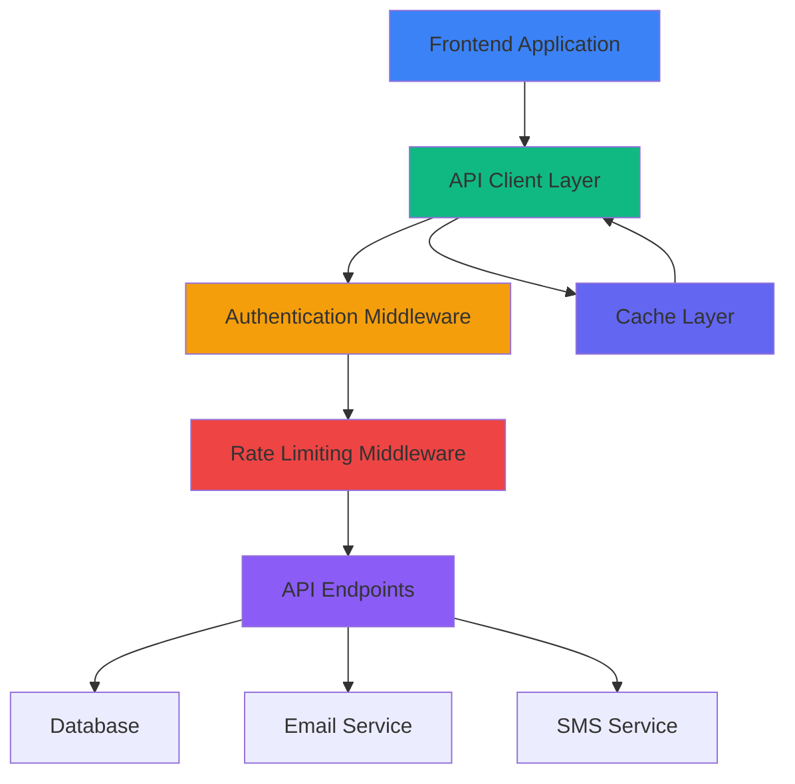
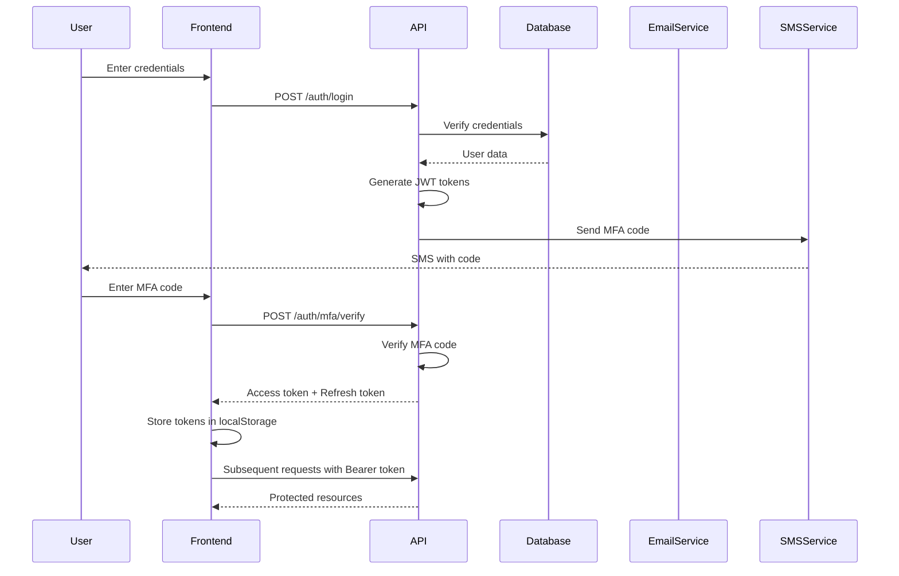
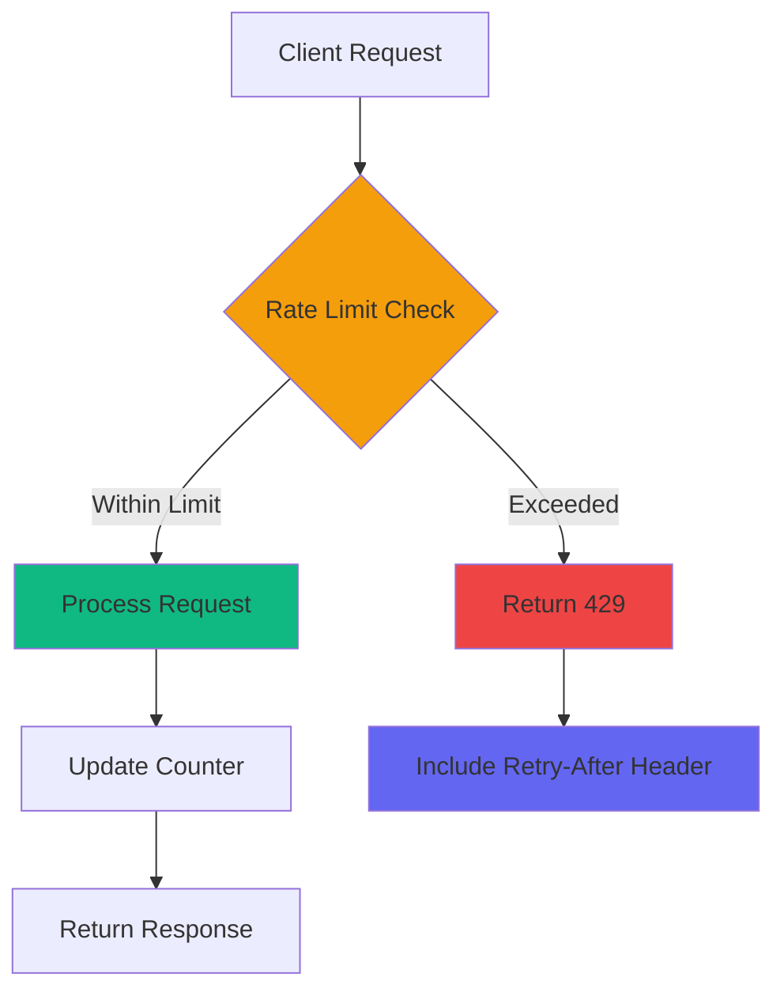
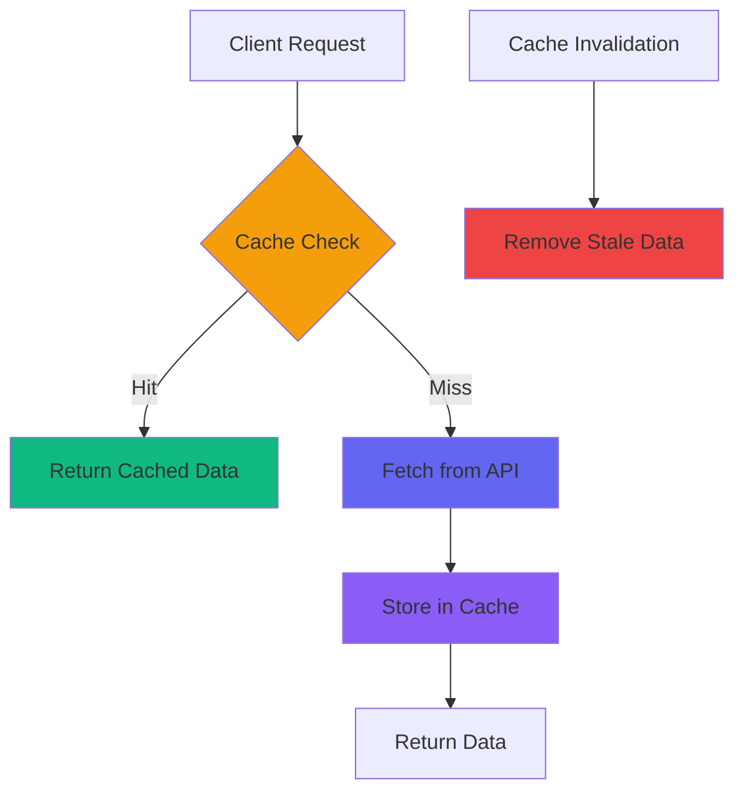

# API Integration Guide

**Project:** Dog Trainers Directory  
**Version:** 1.0.0  
**Date:** 2025-12-25  
**Purpose:** Comprehensive guide for frontend to backend API integration

---

## Overview

This guide provides comprehensive documentation for integrating the Dog Trainers Directory frontend with the backend API. It covers authentication flows, error handling patterns, rate limiting considerations, and caching strategies.

### API Architecture



### API Base URL

```typescript
// Development
const API_BASE_URL = 'http://localhost:3001/api/v1';

// Staging
const API_BASE_URL = 'https://staging-api.dogtrainersdirectory.com.au/api/v1';

// Production
const API_BASE_URL = 'https://api.dogtrainersdirectory.com.au/api/v1';
```

---

## Frontend to Backend API Integration

### API Client Setup

#### Base API Client

```typescript
// src/services/api/client.ts
import axios, { AxiosInstance, AxiosRequestConfig, AxiosResponse } from 'axios';

export interface ApiError {
  message: string;
  code?: string;
  details?: any;
}

export interface ApiResponse<T> {
  success: boolean;
  data?: T;
  error?: ApiError;
  meta?: {
    page?: number;
    limit?: number;
    has_more?: boolean;
    total?: number;
  };
}

class ApiClient {
  private client: AxiosInstance;

  constructor(baseURL: string) {
    this.client = axios.create({
      baseURL,
      timeout: 30000,
      headers: {
        'Content-Type': 'application/json',
      },
    });

    this.setupInterceptors();
  }

  private setupInterceptors(): void {
    // Request interceptor
    this.client.interceptors.request.use(
      (config) => {
        // Add authentication token
        const token = this.getAuthToken();
        if (token) {
          config.headers.Authorization = `Bearer ${token}`;
        }

        // Add request ID for tracing
        config.headers['X-Request-ID'] = this.generateRequestId();

        return config;
      },
      (error) => {
        return Promise.reject(error);
      }
    );

    // Response interceptor
    this.client.interceptors.response.use(
      (response) => {
        return response;
      },
      (error) => {
        return this.handleError(error);
      }
    );
  }

  private getAuthToken(): string | null {
    if (typeof window !== 'undefined') {
      return localStorage.getItem('access_token');
    }
    return null;
  }

  private generateRequestId(): string {
    return `${Date.now()}-${Math.random().toString(36).substr(2, 9)}`;
  }

  private handleError(error: any): Promise<never> {
    if (error.response) {
      // Server responded with error status
      const { status, data } = error.response;

      switch (status) {
        case 401:
          // Unauthorized - clear token and redirect to login
          this.clearAuthToken();
          if (typeof window !== 'undefined') {
            window.location.href = '/login';
          }
          break;
        case 429:
          // Rate limited
          console.warn('Rate limit exceeded:', data);
          break;
        case 500:
          // Server error
          console.error('Server error:', data);
          break;
      }

      return Promise.reject({
        success: false,
        error: {
          message: data.message || 'An error occurred',
          code: data.code,
          details: data.details,
        },
      });
    } else if (error.request) {
      // Request made but no response
      return Promise.reject({
        success: false,
        error: {
          message: 'Network error. Please check your connection.',
        },
      });
    } else {
      // Error setting up request
      return Promise.reject({
        success: false,
        error: {
          message: error.message || 'An unexpected error occurred',
        },
      });
    }
  }

  private clearAuthToken(): void {
    if (typeof window !== 'undefined') {
      localStorage.removeItem('access_token');
      localStorage.removeItem('refresh_token');
    }
  }

  async get<T>(url: string, config?: AxiosRequestConfig): Promise<ApiResponse<T>> {
    try {
      const response: AxiosResponse<ApiResponse<T>> = await this.client.get(url, config);
      return response.data;
    } catch (error) {
      throw error;
    }
  }

  async post<T>(url: string, data?: any, config?: AxiosRequestConfig): Promise<ApiResponse<T>> {
    try {
      const response: AxiosResponse<ApiResponse<T>> = await this.client.post(url, data, config);
      return response.data;
    } catch (error) {
      throw error;
    }
  }

  async put<T>(url: string, data?: any, config?: AxiosRequestConfig): Promise<ApiResponse<T>> {
    try {
      const response: AxiosResponse<ApiResponse<T>> = await this.client.put(url, data, config);
      return response.data;
    } catch (error) {
      throw error;
    }
  }

  async delete<T>(url: string, config?: AxiosRequestConfig): Promise<ApiResponse<T>> {
    try {
      const response: AxiosResponse<ApiResponse<T>> = await this.client.delete(url, config);
      return response.data;
    } catch (error) {
      throw error;
    }
  }
}

// Create singleton instance
const apiClient = new ApiClient(process.env.NEXT_PUBLIC_API_URL || 'http://localhost:3001/api/v1');

export default apiClient;
```

### API Service Layer

#### Trainers Service

```typescript
// src/services/api/trainers.ts
import apiClient, { ApiResponse } from './client';

export interface Trainer {
  id: string;
  name: string;
  email: string;
  phone: string;
  council: string;
  locality: string;
  verified: boolean;
  rating: number;
  review_count: number;
  services: string[];
  specializations: string[];
  certifications: string[];
  bio: string;
  created_at: string;
  updated_at: string;
}

export interface TrainersQuery {
  search?: string;
  council?: string;
  locality?: string;
  service_type?: string;
  verified?: boolean;
  min_rating?: number;
  page?: number;
  limit?: number;
  sort_by?: 'name' | 'rating' | 'created_at';
  sort_order?: 'asc' | 'desc';
}

export interface TrainersResponse {
  trainers: Trainer[];
  meta: {
    page: number;
    limit: number;
    has_more: boolean;
    total: number;
  };
}

export const fetchTrainers = async (query: TrainersQuery = {}): Promise<ApiResponse<TrainersResponse>> => {
  const params = new URLSearchParams();
  
  if (query.search) params.append('search', query.search);
  if (query.council) params.append('council', query.council);
  if (query.locality) params.append('locality', query.locality);
  if (query.service_type) params.append('service_type', query.service_type);
  if (query.verified !== undefined) params.append('verified', query.verified.toString());
  if (query.min_rating) params.append('min_rating', query.min_rating.toString());
  if (query.page) params.append('page', query.page.toString());
  if (query.limit) params.append('limit', query.limit.toString());
  if (query.sort_by) params.append('sort_by', query.sort_by);
  if (query.sort_order) params.append('sort_order', query.sort_order);

  return apiClient.get<TrainersResponse>(`/trainers?${params.toString()}`);
};

export const fetchTrainerProfile = async (id: string): Promise<ApiResponse<Trainer>> => {
  return apiClient.get<Trainer>(`/trainers/${id}`);
};

export const fetchTrainerReviews = async (
  id: string,
  page: number = 1,
  limit: number = 10
): Promise<ApiResponse<any>> => {
  return apiClient.get(`/trainers/${id}/reviews?page=${page}&limit=${limit}`);
};
```

#### Authentication Service

```typescript
// src/services/api/auth.ts
import apiClient, { ApiResponse } from './client';

export interface LoginCredentials {
  email: string;
  password: string;
}

export interface RegisterData {
  name: string;
  email: string;
  password: string;
  phone: string;
  role: 'trainer' | 'owner';
}

export interface AuthResponse {
  user: {
    id: string;
    name: string;
    email: string;
    role: string;
    verified: boolean;
  };
  access_token: string;
  refresh_token: string;
  expires_in: number;
  requires_mfa: boolean;
}

export const login = async (credentials: LoginCredentials): Promise<ApiResponse<AuthResponse>> => {
  const response = await apiClient.post<AuthResponse>('/auth/login', credentials);
  
  if (response.success && response.data) {
    // Store tokens
    if (typeof window !== 'undefined') {
      localStorage.setItem('access_token', response.data.access_token);
      localStorage.setItem('refresh_token', response.data.refresh_token);
      localStorage.setItem('user', JSON.stringify(response.data.user));
    }
  }
  
  return response;
};

export const register = async (data: RegisterData): Promise<ApiResponse<AuthResponse>> => {
  const response = await apiClient.post<AuthResponse>('/auth/register', data);
  
  if (response.success && response.data) {
    // Store tokens
    if (typeof window !== 'undefined') {
      localStorage.setItem('access_token', response.data.access_token);
      localStorage.setItem('refresh_token', response.data.refresh_token);
      localStorage.setItem('user', JSON.stringify(response.data.user));
    }
  }
  
  return response;
};

export const logout = async (): Promise<void> => {
  try {
    await apiClient.post('/auth/logout');
  } finally {
    // Clear tokens regardless of API response
    if (typeof window !== 'undefined') {
      localStorage.removeItem('access_token');
      localStorage.removeItem('refresh_token');
      localStorage.removeItem('user');
    }
  }
};

export const refreshToken = async (): Promise<ApiResponse<AuthResponse>> => {
  const refreshToken = typeof window !== 'undefined' 
    ? localStorage.getItem('refresh_token') 
    : null;
    
  if (!refreshToken) {
    throw new Error('No refresh token available');
  }

  const response = await apiClient.post<AuthResponse>('/auth/refresh', {
    refresh_token: refreshToken,
  });
  
  if (response.success && response.data) {
    // Update tokens
    if (typeof window !== 'undefined') {
      localStorage.setItem('access_token', response.data.access_token);
      localStorage.setItem('refresh_token', response.data.refresh_token);
    }
  }
  
  return response;
};

export const verifyMfa = async (email: string, code: string): Promise<ApiResponse<AuthResponse>> => {
  const response = await apiClient.post<AuthResponse>('/auth/mfa/verify', {
    email,
    mfa_code: code,
  });
  
  if (response.success && response.data) {
    // Store tokens
    if (typeof window !== 'undefined') {
      localStorage.setItem('access_token', response.data.access_token);
      localStorage.setItem('refresh_token', response.data.refresh_token);
      localStorage.setItem('user', JSON.stringify(response.data.user));
    }
  }
  
  return response;
};
```

#### Contact Service

```typescript
// src/services/api/contact.ts
import apiClient, { ApiResponse } from './client';

export interface ContactFormData {
  name: string;
  email: string;
  phone?: string;
  message: string;
  trainer_id?: string;
}

export const submitContactForm = async (data: ContactFormData): Promise<ApiResponse<any>> => {
  return apiClient.post('/contact', data);
};
```

---

## Authentication Flow

### Authentication Architecture



### Login Flow Implementation

#### Login Component

```typescript
// src/components/LoginForm.tsx
import { useState } from 'react';
import { login, verifyMfa } from '../services/api/auth';

export const LoginForm = () => {
  const [email, setEmail] = useState('');
  const [password, setPassword] = useState('');
  const [mfaCode, setMfaCode] = useState('');
  const [requiresMfa, setRequiresMfa] = useState(false);
  const [loading, setLoading] = useState(false);
  const [error, setError] = useState<string | null>(null);

  const handleLogin = async (e: React.FormEvent) => {
    e.preventDefault();
    setLoading(true);
    setError(null);

    try {
      const response = await login({ email, password });

      if (response.success) {
        if (response.data?.requires_mfa) {
          setRequiresMfa(true);
        } else {
          // Redirect to home
          window.location.href = '/';
        }
      } else {
        setError(response.error?.message || 'Login failed');
      }
    } catch (err: any) {
      setError(err.error?.message || 'An error occurred');
    } finally {
      setLoading(false);
    }
  };

  const handleMfaVerify = async (e: React.FormEvent) => {
    e.preventDefault();
    setLoading(true);
    setError(null);

    try {
      const response = await verifyMfa(email, mfaCode);

      if (response.success) {
        // Redirect to home
        window.location.href = '/';
      } else {
        setError(response.error?.message || 'Invalid MFA code');
      }
    } catch (err: any) {
      setError(err.error?.message || 'An error occurred');
    } finally {
      setLoading(false);
    }
  };

  return (
    <div className="login-form">
      {!requiresMfa ? (
        <form onSubmit={handleLogin}>
          <input
            type="email"
            value={email}
            onChange={(e) => setEmail(e.target.value)}
            placeholder="Email"
            required
          />
          <input
            type="password"
            value={password}
            onChange={(e) => setPassword(e.target.value)}
            placeholder="Password"
            required
          />
          {error && <div className="error">{error}</div>}
          <button type="submit" disabled={loading}>
            {loading ? 'Logging in...' : 'Login'}
          </button>
        </form>
      ) : (
        <form onSubmit={handleMfaVerify}>
          <p>Enter the 6-digit code sent to your phone</p>
          <input
            type="text"
            value={mfaCode}
            onChange={(e) => setMfaCode(e.target.value)}
            placeholder="123456"
            maxLength={6}
            required
          />
          {error && <div className="error">{error}</div>}
          <button type="submit" disabled={loading}>
            {loading ? 'Verifying...' : 'Verify'}
          </button>
        </form>
      )}
    </div>
  );
};
```

### Token Refresh Flow

#### Token Refresh Implementation

```typescript
// src/services/api/client.ts (extended)
class ApiClient {
  // ... existing code ...

  private isRefreshing = false;
  private refreshSubscribers: Array<(token: string) => void> = [];

  private subscribeTokenRefresh(callback: (token: string) => void): () => void {
    this.refreshSubscribers.push(callback);
    return () => {
      this.refreshSubscribers = this.refreshSubscribers.filter(
        (cb) => cb !== callback
      );
    };
  }

  private onRefreshed(token: string): void {
    this.refreshSubscribers.forEach((callback) => callback(token));
  }

  private async handleTokenRefresh(): Promise<string> {
    if (this.isRefreshing) {
      return new Promise((resolve) => {
        this.subscribeTokenRefresh((token) => resolve(token));
      });
    }

    this.isRefreshing = true;

    try {
      const response = await refreshToken();
      
      if (response.success && response.data?.access_token) {
        this.onRefreshed(response.data.access_token);
        return response.data.access_token;
      } else {
        throw new Error('Token refresh failed');
      }
    } catch (error) {
      this.clearAuthToken();
      if (typeof window !== 'undefined') {
        window.location.href = '/login';
      }
      throw error;
    } finally {
      this.isRefreshing = false;
    }
  }

  private setupInterceptors(): void {
    this.client.interceptors.request.use(
      (config) => {
        const token = this.getAuthToken();
        if (token) {
          config.headers.Authorization = `Bearer ${token}`;
        }
        config.headers['X-Request-ID'] = this.generateRequestId();
        return config;
      },
      (error) => Promise.reject(error)
    );

    this.client.interceptors.response.use(
      (response) => response,
      async (error) => {
        const originalRequest = error.config;

        if (error.response?.status === 401 && !originalRequest._retry) {
          originalRequest._retry = true;

          try {
            const newToken = await this.handleTokenRefresh();
            originalRequest.headers.Authorization = `Bearer ${newToken}`;
            return this.client(originalRequest);
          } catch (refreshError) {
            return Promise.reject(refreshError);
          }
        }

        return this.handleError(error);
      }
    );
  }
}
```

### Protected Routes

#### Route Protection

```typescript
// src/components/ProtectedRoute.tsx
import { useEffect, useState } from 'react';
import { useRouter } from 'next/navigation';

export const ProtectedRoute = ({ children }: { children: React.ReactNode }) => {
  const router = useRouter();
  const [loading, setLoading] = useState(true);
  const [authenticated, setAuthenticated] = useState(false);

  useEffect(() => {
    const checkAuth = () => {
      const token = localStorage.getItem('access_token');
      
      if (!token) {
        router.push('/login');
        return;
      }

      // Verify token is not expired
      try {
        const payload = JSON.parse(atob(token.split('.')[1]));
        const now = Date.now() / 1000;
        
        if (payload.exp < now) {
          // Token expired, try to refresh
          refreshToken()
            .then(() => setAuthenticated(true))
            .catch(() => router.push('/login'));
        } else {
          setAuthenticated(true);
        }
      } catch (error) {
        router.push('/login');
      } finally {
        setLoading(false);
      }
    };

    checkAuth();
  }, [router]);

  if (loading) {
    return <div>Loading...</div>;
  }

  if (!authenticated) {
    return null;
  }

  return <>{children}</>;
};
```

---

## Error Handling Patterns

### Error Types

```typescript
// src/services/api/errors.ts
export enum ErrorCode {
  // Authentication errors
  UNAUTHORIZED = 'UNAUTHORIZED',
  INVALID_CREDENTIALS = 'INVALID_CREDENTIALS',
  TOKEN_EXPIRED = 'TOKEN_EXPIRED',
  MFA_REQUIRED = 'MFA_REQUIRED',
  INVALID_MFA_CODE = 'INVALID_MFA_CODE',

  // Validation errors
  VALIDATION_ERROR = 'VALIDATION_ERROR',
  INVALID_EMAIL = 'INVALID_EMAIL',
  INVALID_PHONE = 'INVALID_PHONE',
  WEAK_PASSWORD = 'WEAK_PASSWORD',
  PASSWORD_MISMATCH = 'PASSWORD_MISMATCH',

  // Resource errors
  NOT_FOUND = 'NOT_FOUND',
  ALREADY_EXISTS = 'ALREADY_EXISTS',
  CONFLICT = 'CONFLICT',

  // Rate limiting
  RATE_LIMITED = 'RATE_LIMITED',

  // Server errors
  INTERNAL_ERROR = 'INTERNAL_ERROR',
  SERVICE_UNAVAILABLE = 'SERVICE_UNAVAILABLE',
}

export interface ApiError {
  code: ErrorCode;
  message: string;
  details?: any;
  field?: string;
}

export class ApiException extends Error {
  constructor(
    public error: ApiError,
    public statusCode: number
  ) {
    super(error.message);
    this.name = 'ApiException';
  }
}
```

### Error Handling Hook

```typescript
// src/hooks/useApiError.ts
import { useState, useCallback } from 'react';
import { ErrorCode, ApiError } from '../services/api/errors';

export const useApiError = () => {
  const [error, setError] = useState<ApiError | null>(null);
  const [showError, setShowError] = useState(false);

  const handleError = useCallback((err: any) => {
    if (err.error) {
      setError(err.error);
      setShowError(true);
    } else if (err.message) {
      setError({
        code: ErrorCode.INTERNAL_ERROR,
        message: err.message,
      });
      setShowError(true);
    }
  }, []);

  const clearError = useCallback(() => {
    setError(null);
    setShowError(false);
  }, []);

  const getErrorMessage = useCallback((code: ErrorCode): string => {
    const messages: Record<ErrorCode, string> = {
      [ErrorCode.UNAUTHORIZED]: 'You are not authorized to perform this action',
      [ErrorCode.INVALID_CREDENTIALS]: 'Invalid email or password',
      [ErrorCode.TOKEN_EXPIRED]: 'Your session has expired. Please login again',
      [ErrorCode.MFA_REQUIRED]: 'Multi-factor authentication is required',
      [ErrorCode.INVALID_MFA_CODE]: 'Invalid verification code',
      [ErrorCode.VALIDATION_ERROR]: 'Please check your input and try again',
      [ErrorCode.INVALID_EMAIL]: 'Please enter a valid email address',
      [ErrorCode.INVALID_PHONE]: 'Please enter a valid phone number',
      [ErrorCode.WEAK_PASSWORD]: 'Password must be at least 8 characters and include uppercase, lowercase, number, and special character',
      [ErrorCode.PASSWORD_MISMATCH]: 'Passwords do not match',
      [ErrorCode.NOT_FOUND]: 'The requested resource was not found',
      [ErrorCode.ALREADY_EXISTS]: 'This resource already exists',
      [ErrorCode.CONFLICT]: 'There is a conflict with the current state',
      [ErrorCode.RATE_LIMITED]: 'Too many requests. Please try again later',
      [ErrorCode.INTERNAL_ERROR]: 'An unexpected error occurred. Please try again',
      [ErrorCode.SERVICE_UNAVAILABLE]: 'The service is temporarily unavailable',
    };

    return messages[code] || 'An error occurred';
  }, []);

  return {
    error,
    showError,
    handleError,
    clearError,
    getErrorMessage,
  };
};
```

### Error Boundary Component

```typescript
// src/components/ErrorBoundary.tsx
import { Component, ReactNode } from 'react';
import { useApiError } from '../hooks/useApiError';

interface Props {
  children: ReactNode;
  fallback?: ReactNode;
}

interface State {
  hasError: boolean;
  error: Error | null;
}

export class ErrorBoundary extends Component<Props, State> {
  constructor(props: Props) {
    super(props);
    this.state = { hasError: false, error: null };
  }

  static getDerivedStateFromError(error: Error): State {
    return { hasError: true, error };
  }

  componentDidCatch(error: Error, errorInfo: any) {
    console.error('Error caught by boundary:', error, errorInfo);
    
    // Log error to monitoring service
    if (typeof window !== 'undefined' && 'navigator' in window) {
      // Send to error tracking service
      // Example: Sentry.captureException(error);
    }
  }

  render() {
    if (this.state.hasError) {
      return this.props.fallback || (
        <div className="error-boundary">
          <h1>Something went wrong</h1>
          <p>We apologize for the inconvenience. Please try again.</p>
          <button onClick={() => window.location.reload()}>
            Reload Page
          </button>
        </div>
      );
    }

    return this.props.children;
  }
}
```

---

## Rate Limiting Considerations

### Rate Limiting Strategy



### Client-Side Rate Limiting

```typescript
// src/services/api/rateLimiter.ts
interface RateLimitConfig {
  maxRequests: number;
  windowMs: number;
}

class RateLimiter {
  private requests: number[] = [];
  private config: RateLimitConfig;

  constructor(config: RateLimitConfig) {
    this.config = config;
  }

  async acquire(): Promise<void> {
    const now = Date.now();
    
    // Remove requests outside the time window
    this.requests = this.requests.filter(
      (timestamp) => now - timestamp < this.config.windowMs
    );

    // Check if limit is exceeded
    if (this.requests.length >= this.config.maxRequests) {
      const oldestRequest = this.requests[0];
      const waitTime = this.config.windowMs - (now - oldestRequest);
      
      await new Promise((resolve) => setTimeout(resolve, waitTime));
    }

    // Add current request
    this.requests.push(now);
  }

  reset(): void {
    this.requests = [];
  }
}

// Create rate limiter instances
export const apiRateLimiter = new RateLimiter({
  maxRequests: 100,
  windowMs: 15 * 60 * 1000, // 15 minutes
});

export const searchRateLimiter = new RateLimiter({
  maxRequests: 30,
  windowMs: 15 * 60 * 1000, // 15 minutes
});

export const contactRateLimiter = new RateLimiter({
  maxRequests: 5,
  windowMs: 60 * 60 * 1000, // 1 hour
});
```

### Rate Limiting Middleware Integration

```typescript
// src/services/api/client.ts (extended)
import { apiRateLimiter, searchRateLimiter, contactRateLimiter } from './rateLimiter';

class ApiClient {
  // ... existing code ...

  async get<T>(url: string, config?: AxiosRequestConfig): Promise<ApiResponse<T>> {
    try {
      // Apply rate limiting based on endpoint
      if (url.includes('/trainers')) {
        await searchRateLimiter.acquire();
      } else if (url.includes('/contact')) {
        await contactRateLimiter.acquire();
      } else {
        await apiRateLimiter.acquire();
      }

      const response: AxiosResponse<ApiResponse<T>> = await this.client.get(url, config);
      return response.data;
    } catch (error) {
      throw error;
    }
  }

  async post<T>(url: string, data?: any, config?: AxiosRequestConfig): Promise<ApiResponse<T>> {
    try {
      // Apply rate limiting based on endpoint
      if (url.includes('/contact')) {
        await contactRateLimiter.acquire();
      } else {
        await apiRateLimiter.acquire();
      }

      const response: AxiosResponse<ApiResponse<T>> = await this.client.post(url, data, config);
      return response.data;
    } catch (error) {
      throw error;
    }
  }
}
```

### Handling Rate Limit Responses

```typescript
// src/services/api/client.ts (extended)
private handleError(error: any): Promise<never> {
  if (error.response) {
    const { status, data, headers } = error.response;

    switch (status) {
      case 429:
        // Rate limited
        const retryAfter = headers['retry-after'];
        const waitTime = retryAfter 
          ? parseInt(retryAfter) * 1000 
          : 60000; // Default 1 minute

        console.warn(`Rate limit exceeded. Retry after ${waitTime}ms`);
        
        // Store retry time for UI feedback
        if (typeof window !== 'undefined') {
          localStorage.setItem('rate_limit_reset', (Date.now() + waitTime).toString());
        }

        return Promise.reject({
          success: false,
          error: {
            message: 'Too many requests. Please try again later.',
            code: 'RATE_LIMITED',
            retry_after: waitTime,
          },
        });

      // ... other cases ...
    }
  }

  // ... existing error handling ...
}
```

### Rate Limit UI Feedback

```typescript
// src/components/RateLimitWarning.tsx
import { useEffect, useState } from 'react';

export const RateLimitWarning = () => {
  const [showWarning, setShowWarning] = useState(false);
  const [retryTime, setRetryTime] = useState<number | null>(null);

  useEffect(() => {
    const checkRateLimit = () => {
      const resetTime = localStorage.getItem('rate_limit_reset');
      
      if (resetTime) {
        const now = Date.now();
        const remaining = parseInt(resetTime) - now;
        
        if (remaining > 0) {
          setShowWarning(true);
          setRetryTime(remaining);
        } else {
          setShowWarning(false);
          localStorage.removeItem('rate_limit_reset');
        }
      }
    };

    checkRateLimit();
    const interval = setInterval(checkRateLimit, 1000);

    return () => clearInterval(interval);
  }, []);

  if (!showWarning || !retryTime) {
    return null;
  }

  const minutes = Math.floor(retryTime / 60000);
  const seconds = Math.floor((retryTime % 60000) / 1000);

  return (
    <div className="rate-limit-warning">
      <p>
        You have reached the request limit. Please try again in{' '}
        {minutes > 0 && `${minutes} minute${minutes > 1 ? 's' : ''} `}
        {seconds} second{seconds !== 1 ? 's' : ''}.
      </p>
    </div>
  );
};
```

---

## Caching Strategy

### Caching Architecture



### Cache Implementation

```typescript
// src/services/api/cache.ts
interface CacheEntry<T> {
  data: T;
  timestamp: number;
  ttl: number;
}

class ApiCache {
  private cache: Map<string, CacheEntry<any>> = new Map();

  set<T>(key: string, data: T, ttl: number = 5 * 60 * 1000): void {
    this.cache.set(key, {
      data,
      timestamp: Date.now(),
      ttl,
    });
  }

  get<T>(key: string): T | null {
    const entry = this.cache.get(key);
    
    if (!entry) {
      return null;
    }

    const now = Date.now();
    const age = now - entry.timestamp;

    if (age > entry.ttl) {
      this.cache.delete(key);
      return null;
    }

    return entry.data as T;
  }

  invalidate(key: string): void {
    this.cache.delete(key);
  }

  invalidatePattern(pattern: string): void {
    const regex = new RegExp(pattern);
    
    for (const key of this.cache.keys()) {
      if (regex.test(key)) {
        this.cache.delete(key);
      }
    }
  }

  clear(): void {
    this.cache.clear();
  }
}

// Create singleton instance
export const apiCache = new ApiCache();
```

### Cache Middleware Integration

```typescript
// src/services/api/client.ts (extended)
import { apiCache } from './cache';

class ApiClient {
  // ... existing code ...

  async get<T>(
    url: string,
    config?: AxiosRequestConfig & { cache?: boolean; ttl?: number }
  ): Promise<ApiResponse<T>> {
    const { cache: useCache = false, ttl = 5 * 60 * 1000, ...axiosConfig } = config || {};

    // Check cache if enabled
    if (useCache) {
      const cached = apiCache.get<ApiResponse<T>>(url);
      
      if (cached) {
        console.log(`Cache hit for ${url}`);
        return cached;
      }
    }

    try {
      const response: AxiosResponse<ApiResponse<T>> = await this.client.get(url, axiosConfig);
      
      // Store in cache if enabled
      if (useCache && response.data.success) {
        apiCache.set(url, response.data, ttl);
      }

      return response.data;
    } catch (error) {
      throw error;
    }
  }
}
```

### Cache Usage Examples

#### Cached Trainer List

```typescript
// src/services/api/trainers.ts (extended)
export const fetchTrainers = async (
  query: TrainersQuery = {},
  useCache: boolean = true
): Promise<ApiResponse<TrainersResponse>> => {
  const params = new URLSearchParams();
  
  if (query.search) params.append('search', query.search);
  if (query.council) params.append('council', query.council);
  if (query.locality) params.append('locality', query.locality);
  if (query.service_type) params.append('service_type', query.service_type);
  if (query.verified !== undefined) params.append('verified', query.verified.toString());
  if (query.min_rating) params.append('min_rating', query.min_rating.toString());
  if (query.page) params.append('page', query.page.toString());
  if (query.limit) params.append('limit', query.limit.toString());
  if (query.sort_by) params.append('sort_by', query.sort_by);
  if (query.sort_order) params.append('sort_order', query.sort_order);

  return apiClient.get<TrainersResponse>(
    `/trainers?${params.toString()}`,
    { cache: useCache, ttl: 5 * 60 * 1000 } // 5 minutes
  );
};
```

#### Cached Trainer Profile

```typescript
// src/services/api/trainers.ts (extended)
export const fetchTrainerProfile = async (
  id: string,
  useCache: boolean = true
): Promise<ApiResponse<Trainer>> => {
  return apiClient.get<Trainer>(
    `/trainers/${id}`,
    { cache: useCache, ttl: 10 * 60 * 1000 } // 10 minutes
  );
};
```

### Cache Invalidation

```typescript
// src/services/api/cache.ts (extended)
export const invalidateTrainerCache = (trainerId?: string): void => {
  if (trainerId) {
    // Invalidate specific trainer profile
    apiCache.invalidate(`/trainers/${trainerId}`);
  }
  
  // Invalidate trainer list
  apiCache.invalidatePattern('^/trainers\\?');
};

export const invalidateAuthCache = (): void => {
  apiCache.invalidatePattern('^/auth/');
};

export const invalidateSearchCache = (): void => {
  apiCache.invalidatePattern('^/trainers\\?');
};
```

### Cache Invalidation on User Actions

```typescript
// src/services/api/auth.ts (extended)
export const logout = async (): Promise<void> => {
  try {
    await apiClient.post('/auth/logout');
  } finally {
    // Clear tokens
    if (typeof window !== 'undefined') {
      localStorage.removeItem('access_token');
      localStorage.removeItem('refresh_token');
      localStorage.removeItem('user');
    }
    
    // Invalidate auth cache
    invalidateAuthCache();
  }
};
```

---

## Best Practices

### Request Optimization

```typescript
// src/services/api/optimization.ts
import { debounce } from 'lodash-es';

// Debounce search requests
export const debouncedSearch = debounce(
  async (query: string) => {
    return fetchTrainers({ search: query });
  },
  300
);

// Cancel pending requests
const pendingRequests = new Map<string, AbortController>();

export const fetchWithCancellation = async <T>(
  key: string,
  fetchFn: () => Promise<T>
): Promise<T> => {
  // Cancel previous request with same key
  const previousController = pendingRequests.get(key);
  if (previousController) {
    previousController.abort();
  }

  // Create new controller
  const controller = new AbortController();
  pendingRequests.set(key, controller);

  try {
    const result = await fetchFn();
    pendingRequests.delete(key);
    return result;
  } catch (error) {
    pendingRequests.delete(key);
    throw error;
  }
};
```

### Request Retry Logic

```typescript
// src/services/api/retry.ts
export async function retryRequest<T>(
  fn: () => Promise<T>,
  maxRetries: number = 3,
  delay: number = 1000
): Promise<T> {
  let lastError: any;

  for (let i = 0; i < maxRetries; i++) {
    try {
      return await fn();
    } catch (error) {
      lastError = error;
      
      // Don't retry on client errors (4xx)
      if (error.response?.status >= 400 && error.response?.status < 500) {
        throw error;
      }

      // Wait before retrying
      if (i < maxRetries - 1) {
        await new Promise((resolve) => setTimeout(resolve, delay * (i + 1)));
      }
    }
  }

  throw lastError;
}
```

### Request Batching

```typescript
// src/services/api/batching.ts
class RequestBatcher<T> {
  private batch: Array<{ resolve: (value: T) => void; reject: (error: any) => void }> = [];
  private timer: NodeJS.Timeout | null = null;

  constructor(
    private batchFn: (items: any[]) => Promise<T[]>,
    private batchDelay: number = 100
  ) {}

  add(item: any): Promise<T> {
    return new Promise((resolve, reject) => {
      this.batch.push({ resolve, reject });

      if (this.batch.length === 1) {
        this.timer = setTimeout(() => this.flush(), this.batchDelay);
      }
    });
  }

  private async flush(): Promise<void> {
    if (this.timer) {
      clearTimeout(this.timer);
      this.timer = null;
    }

    const batch = [...this.batch];
    this.batch = [];

    try {
      const results = await this.batchFn(batch.map((b) => b));
      batch.forEach((b, i) => b.resolve(results[i]));
    } catch (error) {
      batch.forEach((b) => b.reject(error));
    }
  }
}

// Usage example
const trainerBatcher = new RequestBatcher(
  async (ids) => {
    const response = await apiClient.post('/trainers/batch', { ids });
    return response.data.data;
  }
);

// Batch multiple trainer profile requests
const trainer1 = await trainerBatcher.add('trainer-1');
const trainer2 = await trainerBatcher.add('trainer-2');
const trainer3 = await trainerBatcher.add('trainer-3');
```

---

## Appendix A: API Endpoints Reference

### Authentication Endpoints

| Method | Endpoint | Description | Auth Required |
|---------|-----------|-------------|----------------|
| POST | `/auth/register` | Register new user | No |
| POST | `/auth/login` | Login user | No |
| POST | `/auth/logout` | Logout user | Yes |
| POST | `/auth/refresh` | Refresh access token | No |
| POST | `/auth/mfa/verify` | Verify MFA code | No |

### Trainer Endpoints

| Method | Endpoint | Description | Auth Required |
|---------|-----------|-------------|----------------|
| GET | `/trainers` | List trainers | No |
| GET | `/trainers/:id` | Get trainer profile | No |
| GET | `/trainers/:id/reviews` | Get trainer reviews | No |
| POST | `/trainers` | Create trainer profile | Yes |
| PUT | `/trainers/:id` | Update trainer profile | Yes |
| DELETE | `/trainers/:id` | Delete trainer profile | Yes |

### Contact Endpoints

| Method | Endpoint | Description | Auth Required |
|---------|-----------|-------------|----------------|
| POST | `/contact` | Submit contact form | No |

---

## Appendix B: Related Documentation

- [`DOCS/production-readiness-summary.md`](DOCS/production-readiness-summary.md) - Production readiness overview
- [`DOCS/deployment-guide.md`](DOCS/deployment-guide.md) - Deployment procedures
- [`DOCS/testing-strategy.md`](DOCS/testing-strategy.md) - Testing approach
- [`openapi.yaml`](../openapi.yaml) - Complete API specification
- [`src/db/migrations/`](../src/db/migrations/) - Database schema

---

**Document Version:** 1.0.0  
**Last Updated:** 2025-12-25  
**Next Review:** After first production deployment
