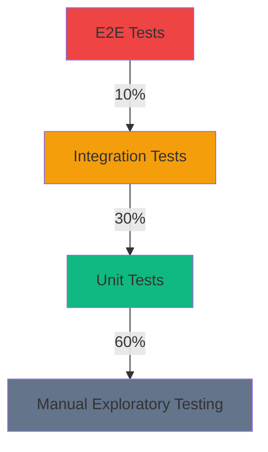

# Testing Strategy

**Project:** Dog Trainers Directory  
**Version:** 1.0.0  
**Date:** 2025-12-25  
**Purpose:** Comprehensive testing approach for production readiness

---

## Overview

This document outlines the comprehensive testing strategy for the Dog Trainers Directory application. It covers unit testing, integration testing, end-to-end (E2E) testing, accessibility testing, performance testing, and security testing.

### Testing Philosophy

- **Shift Left:** Test early and often in the development cycle
- **Test Coverage:** Aim for >80% code coverage across all components
- **Automation First:** Prioritize automated tests over manual testing
- **Continuous Testing:** Integrate testing into CI/CD pipeline
- **User-Centric:** Focus on user experience and real-world scenarios

### Testing Pyramid



---

## Unit Testing

### Purpose

Unit tests verify individual functions, components, and modules in isolation. They provide fast feedback and help catch bugs early in the development cycle.

### Testing Framework

**Framework:** Jest + React Testing Library

**Configuration:**

```javascript
// jest.config.js
module.exports = {
  testEnvironment: 'jsdom',
  setupFilesAfterEnv: ['<rootDir>/jest.setup.js'],
  moduleNameMapper: {
    '^@/(.*)$': '<rootDir>/src/$1',
  },
  collectCoverageFrom: [
    'src/**/*.{js,jsx,ts,tsx}',
    '!src/**/*.d.ts',
    '!src/**/*.stories.{js,jsx,ts,tsx}',
    '!src/**/__tests__/**',
  ],
  coverageThreshold: {
    global: {
      branches: 80,
      functions: 80,
      lines: 80,
      statements: 80,
    },
  },
  testMatch: [
    '**/__tests__/**/*.test.{js,jsx,ts,tsx}',
  ],
};
```

### Component Testing

#### Test Structure

```typescript
// src/components/Button/__tests__/Button.test.tsx
import { render, screen, fireEvent } from '@testing-library/react';
import { Button } from '../Button';

describe('Button Component', () => {
  describe('Rendering', () => {
    it('renders with correct text', () => {
      render(<Button>Click Me</Button>);
      expect(screen.getByText('Click Me')).toBeInTheDocument();
    });

    it('renders with correct variant', () => {
      render(<Button variant="primary">Primary</Button>);
      const button = screen.getByRole('button');
      expect(button).toHaveClass('bg-primary-brand');
    });

    it('renders with disabled state', () => {
      render(<Button disabled>Disabled</Button>);
      const button = screen.getByRole('button');
      expect(button).toBeDisabled();
    });
  });

  describe('Interactions', () => {
    it('calls onClick when clicked', () => {
      const handleClick = jest.fn();
      render(<Button onClick={handleClick}>Click Me</Button>);
      fireEvent.click(screen.getByRole('button'));
      expect(handleClick).toHaveBeenCalledTimes(1);
    });

    it('does not call onClick when disabled', () => {
      const handleClick = jest.fn();
      render(<Button onClick={handleClick} disabled>Disabled</Button>);
      fireEvent.click(screen.getByRole('button'));
      expect(handleClick).not.toHaveBeenCalled();
    });
  });

  describe('Accessibility', () => {
    it('has correct ARIA attributes', () => {
      render(<Button aria-label="Submit form">Submit</Button>);
      const button = screen.getByRole('button');
      expect(button).toHaveAttribute('aria-label', 'Submit form');
    });

    it('is keyboard accessible', () => {
      render(<Button>Click Me</Button>);
      const button = screen.getByRole('button');
      button.focus();
      expect(button).toHaveFocus();
    });
  });
});
```

#### Component Testing Checklist

- [ ] Renders correctly with default props
- [ ] Renders correctly with all prop variations
- [ ] Handles user interactions (click, hover, focus)
- [ ] Displays correct error states
- [ ] Displays correct loading states
- [ ] Has correct ARIA attributes
- [ ] Is keyboard accessible
- [ ] Has correct focus management
- [ ] Matches design system specifications

### Utility Function Testing

#### Test Structure

```typescript
// src/utils/validation/__tests__/validation.test.ts
import { validateEmail, validatePhone, validatePassword } from '../validation';

describe('Validation Utilities', () => {
  describe('validateEmail', () => {
    it('returns true for valid email', () => {
      expect(validateEmail('test@example.com')).toBe(true);
    });

    it('returns false for invalid email', () => {
      expect(validateEmail('invalid-email')).toBe(false);
    });

    it('returns false for empty email', () => {
      expect(validateEmail('')).toBe(false);
    });

    it('handles edge cases', () => {
      expect(validateEmail('test@')).toBe(false);
      expect(validateEmail('@example.com')).toBe(false);
    });
  });

  describe('validatePhone', () => {
    it('returns true for valid Australian phone', () => {
      expect(validatePhone('0412 345 678')).toBe(true);
    });

    it('returns false for invalid phone', () => {
      expect(validatePhone('12345')).toBe(false);
    });

    it('handles different formats', () => {
      expect(validatePhone('+61 412 345 678')).toBe(true);
      expect(validatePhone('0412345678')).toBe(true);
    });
  });

  describe('validatePassword', () => {
    it('returns true for strong password', () => {
      expect(validatePassword('StrongP@ssw0rd!')).toBe(true);
    });

    it('returns false for weak password', () => {
      expect(validatePassword('password')).toBe(false);
    });

    it('enforces minimum length', () => {
      expect(validatePassword('short')).toBe(false);
    });
  });
});
```

### Hook Testing

#### Test Structure

```typescript
// src/hooks/useAuth/__tests__/useAuth.test.ts
import { renderHook, act } from '@testing-library/react';
import { useAuth } from '../useAuth';

describe('useAuth Hook', () => {
  it('initializes with unauthenticated state', () => {
    const { result } = renderHook(() => useAuth());
    expect(result.current.isAuthenticated).toBe(false);
    expect(result.current.user).toBeNull();
  });

  it('updates state on login', async () => {
    const { result } = renderHook(() => useAuth());
    
    await act(async () => {
      await result.current.login('test@example.com', 'password');
    });
    
    expect(result.current.isAuthenticated).toBe(true);
    expect(result.current.user).toEqual({
      email: 'test@example.com',
      name: 'Test User',
    });
  });

  it('clears state on logout', async () => {
    const { result } = renderHook(() => useAuth());
    
    await act(async () => {
      await result.current.login('test@example.com', 'password');
      await result.current.logout();
    });
    
    expect(result.current.isAuthenticated).toBe(false);
    expect(result.current.user).toBeNull();
  });
});
```

### Service Testing

#### Test Structure

```typescript
// src/services/api/__tests__/api.test.ts
import { fetchTrainers, fetchTrainerProfile } from '../api';

// Mock fetch
global.fetch = jest.fn();

describe('API Service', () => {
  beforeEach(() => {
    (global.fetch as jest.Mock).mockClear();
  });

  describe('fetchTrainers', () => {
    it('fetches trainers successfully', async () => {
      const mockResponse = {
        success: true,
        data: [
          { id: '1', name: 'Trainer 1' },
          { id: '2', name: 'Trainer 2' },
        ],
      };
      
      (global.fetch as jest.Mock).mockResolvedValueOnce({
        ok: true,
        json: () => Promise.resolve(mockResponse),
      } as Response);
      
      const result = await fetchTrainers({ verified: true });
      
      expect(result.success).toBe(true);
      expect(result.data).toHaveLength(2);
    });

    it('handles API errors', async () => {
      (global.fetch as jest.Mock).mockResolvedValueOnce({
        ok: false,
        status: 500,
      } as Response);
      
      const result = await fetchTrainers({});
      
      expect(result.success).toBe(false);
      expect(result.error).toBeDefined();
    });

    it('handles network errors', async () => {
      (global.fetch as jest.Mock).mockRejectedValueOnce(
        new Error('Network error')
      );
      
      const result = await fetchTrainers({});
      
      expect(result.success).toBe(false);
      expect(result.error).toEqual('Network error');
    });
  });

  describe('fetchTrainerProfile', () => {
    it('fetches trainer profile successfully', async () => {
      const mockResponse = {
        success: true,
        data: {
          id: '1',
          name: 'Trainer 1',
          email: 'trainer@example.com',
        },
      };
      
      (global.fetch as jest.Mock).mockResolvedValueOnce({
        ok: true,
        json: () => Promise.resolve(mockResponse),
      } as Response);
      
      const result = await fetchTrainerProfile('1');
      
      expect(result.success).toBe(true);
      expect(result.data).toEqual(mockResponse.data);
    });

    it('handles 404 errors', async () => {
      (global.fetch as jest.Mock).mockResolvedValueOnce({
        ok: false,
        status: 404,
      } as Response);
      
      const result = await fetchTrainerProfile('nonexistent');
      
      expect(result.success).toBe(false);
      expect(result.error).toBeDefined();
    });
  });
});
```

---

## Integration Testing

### Purpose

Integration tests verify that different modules and services work together correctly. They test API endpoints, database interactions, and external service integrations.

### Testing Framework

**Framework:** Jest + Supertest (for API testing)

**Configuration:**

```javascript
// tests/integration/setup.ts
import { Pool } from 'pg';
import { app } from '../../src/app';

export const testPool = new Pool({
  host: process.env.TEST_DB_HOST || 'localhost',
  port: parseInt(process.env.TEST_DB_PORT || '5432'),
  database: process.env.TEST_DB_NAME || 'dogtrainersdirectory_test',
  user: process.env.TEST_DB_USER || 'postgres',
  password: process.env.TEST_DB_PASSWORD || 'test_password',
});

beforeAll(async () => {
  // Setup test database
  await testPool.query(`
    CREATE TABLE IF NOT EXISTS test_trainers (
      id UUID PRIMARY KEY DEFAULT gen_random_uuid(),
      name VARCHAR(200) NOT NULL,
      email VARCHAR(255) NOT NULL,
      verified BOOLEAN DEFAULT false
    );
  `);
});

afterAll(async () => {
  // Cleanup test database
  await testPool.query('DROP TABLE IF EXISTS test_trainers');
  await testPool.end();
});

beforeEach(async () => {
  // Clear test data before each test
  await testPool.query('TRUNCATE test_trainers');
});
```

### API Endpoint Testing

#### Test Structure

```typescript
// tests/integration/api/trainers.test.ts
import request from 'supertest';
import { app } from '../../../src/app';

describe('Trainers API Integration Tests', () => {
  describe('GET /api/v1/trainers', () => {
    it('returns list of trainers', async () => {
      const response = await request(app)
        .get('/api/v1/trainers')
        .expect(200);
      
      expect(response.body.success).toBe(true);
      expect(Array.isArray(response.body.data)).toBe(true);
      expect(response.body.data.length).toBeGreaterThan(0);
    });

    it('filters by verified status', async () => {
      const response = await request(app)
        .get('/api/v1/trainers?verified=true')
        .expect(200);
      
      expect(response.body.success).toBe(true);
      response.body.data.forEach((trainer: any) => {
        expect(trainer.verified).toBe(true);
      });
    });

    it('paginates results', async () => {
      const response = await request(app)
        .get('/api/v1/trainers?page=1&limit=10')
        .expect(200);
      
      expect(response.body.success).toBe(true);
      expect(response.body.data.length).toBeLessThanOrEqual(10);
      expect(response.body.meta).toHaveProperty('page');
      expect(response.body.meta).toHaveProperty('has_more');
    });

    it('handles invalid query parameters', async () => {
      const response = await request(app)
        .get('/api/v1/trainers?limit=invalid')
        .expect(400);
      
      expect(response.body.success).toBe(false);
      expect(response.body.error).toBeDefined();
    });
  });

  describe('GET /api/v1/trainers/:id', () => {
    it('returns trainer profile', async () => {
      const response = await request(app)
        .get('/api/v1/trainers/1')
        .expect(200);
      
      expect(response.body.success).toBe(true);
      expect(response.body.data).toHaveProperty('id');
      expect(response.body.data).toHaveProperty('name');
    });

    it('returns 404 for non-existent trainer', async () => {
      const response = await request(app)
        .get('/api/v1/trainers/nonexistent')
        .expect(404);
      
      expect(response.body.success).toBe(false);
      expect(response.body.error).toBeDefined();
    });
  });

  describe('POST /api/v1/auth/register', () => {
    it('creates new user account', async () => {
      const newUser = {
        name: 'Test User',
        email: 'test@example.com',
        password: 'SecureP@ss123',
        phone: '+61400000000',
        role: 'trainer',
      };
      
      const response = await request(app)
        .post('/api/v1/auth/register')
        .send(newUser)
        .expect(201);
      
      expect(response.body.success).toBe(true);
      expect(response.body.data).toHaveProperty('id');
      expect(response.body.data).toHaveProperty('access_token');
    });

    it('validates required fields', async () => {
      const invalidUser = {
        name: '',
        email: 'invalid-email',
        password: 'short',
      };
      
      const response = await request(app)
        .post('/api/v1/auth/register')
        .send(invalidUser)
        .expect(400);
      
      expect(response.body.success).toBe(false);
      expect(response.body.error).toBeDefined();
    });

    it('prevents duplicate email registration', async () => {
      const existingUser = {
        name: 'Test User',
        email: 'existing@example.com',
        password: 'SecureP@ss123',
        phone: '+61400000000',
        role: 'trainer',
      };
      
      const response = await request(app)
        .post('/api/v1/auth/register')
        .send(existingUser)
        .expect(409);
      
      expect(response.body.success).toBe(false);
      expect(response.body.error).toContain('already exists');
    });
  });
});
```

### Database Integration Testing

#### Test Structure

```typescript
// tests/integration/database/migrations.test.ts
import { Pool } from 'pg';
import { MigrationRunner } from '../../../src/db/migrations/migrate';

describe('Database Migration Integration Tests', () => {
  let pool: Pool;
  let runner: MigrationRunner;

  beforeAll(async () => {
    pool = new Pool({
      host: process.env.TEST_DB_HOST || 'localhost',
      port: parseInt(process.env.TEST_DB_PORT || '5432'),
      database: process.env.TEST_DB_NAME || 'dogtrainersdirectory_test',
      user: process.env.TEST_DB_USER || 'postgres',
      password: process.env.TEST_DB_PASSWORD || 'test_password',
    });
    
    runner = new MigrationRunner(pool, testMigrations);
    await runner.initialize();
  });

  afterAll(async () => {
    await pool.end();
  });

  describe('Migration Application', () => {
    it('creates all tables', async () => {
      await runner.migrate();
      
      const tables = await pool.query(`
        SELECT table_name 
        FROM information_schema.tables 
        WHERE table_schema = 'public'
      `);
      
      expect(tables.rows.length).toBeGreaterThan(0);
    });

    it('creates all indexes', async () => {
      await runner.migrate();
      
      const indexes = await pool.query(`
        SELECT indexname 
        FROM pg_indexes 
        WHERE schemaname = 'public'
      `);
      
      expect(indexes.rows.length).toBeGreaterThan(0);
    });

    it('creates all triggers', async () => {
      await runner.migrate();
      
      const triggers = await pool.query(`
        SELECT trigger_name 
        FROM information_schema.triggers 
        WHERE trigger_schema = 'public'
      `);
      
      expect(triggers.rows.length).toBeGreaterThan(0);
    });
  });

  describe('Migration Rollback', () => {
    it('rolls back migrations correctly', async () => {
      await runner.migrate();
      await runner.rollback();
      
      const tables = await pool.query(`
        SELECT table_name 
        FROM information_schema.tables 
        WHERE table_schema = 'public'
      `);
      
      expect(tables.rows.length).toBe(0);
    });

    it('records rollback in _migrations table', async () => {
      await runner.migrate();
      await runner.rollback();
      
      const migrations = await pool.query('SELECT * FROM _migrations');
      expect(migrations.rows[0].rolled_back_at).toBeDefined();
    });
  });

  describe('Data Integrity', () => {
    it('enforces foreign key constraints', async () => {
      await runner.migrate();
      
      // Try to insert trainer with invalid council
      await expect(
        pool.query(`
          INSERT INTO businesses (name, locality_id, council_id, phone)
          VALUES ('Test', 'invalid-locality-id', 'invalid-council-id', '0412345678')
        `)
      ).rejects.toThrow();
    });

    it('enforces unique constraints', async () => {
      await runner.migrate();
      
      // Try to insert duplicate email
      await pool.query(`
        INSERT INTO users (email, password_hash, name)
        VALUES ('test@example.com', 'hash1', 'User 1')
      `);
      
      await expect(
        pool.query(`
          INSERT INTO users (email, password_hash, name)
          VALUES ('test@example.com', 'hash2', 'User 2')
        `)
      ).rejects.toThrow();
    });

    it('enforces CHECK constraints', async () => {
      await runner.migrate();
      
      // Try to insert invalid phone format
      await expect(
        pool.query(`
          INSERT INTO businesses (name, locality_id, council_id, phone)
          VALUES ('Test', 'locality-1', 'council-1', 'invalid-phone')
        `)
      ).rejects.toThrow();
    });
  });
});
```

---

## End-to-End (E2E) Testing

### Purpose

E2E tests verify that the application works as expected from a user's perspective. They test complete user flows across multiple pages and components.

### Testing Framework

**Framework:** Playwright

**Configuration:**

```typescript
// playwright.config.ts
import { defineConfig, devices } from '@playwright/test';

export default defineConfig({
  testDir: './tests/e2e',
  fullyParallel: true,
  forbidOnly: !!process.env.CI,
  retries: process.env.CI ? 2 : 0,
  workers: process.env.CI ? 1 : undefined,
  reporter: [
    ['html'],
    ['junit', { outputFile: 'test-results/junit.xml' }],
  ],
  use: {
    baseURL: process.env.BASE_URL || 'http://localhost:3000',
    trace: 'on-first-retry',
    screenshot: 'only-on-failure',
  },
  projects: [
    {
      name: 'chromium',
      use: { ...devices['Desktop Chrome'] },
    },
    {
      name: 'firefox',
      use: { ...devices['Desktop Firefox'] },
    },
    {
      name: 'webkit',
      use: { ...devices['Desktop Safari'] },
    },
  ],
});
```

### Critical User Flows

#### Registration Flow

```typescript
// tests/e2e/registration.spec.ts
import { test, expect } from '@playwright/test';

test.describe('User Registration Flow', () => {
  test('user can register new account', async ({ page }) => {
    await page.goto('/register');
    
    // Fill registration form
    await page.fill('input[name="name"]', 'John Doe');
    await page.fill('input[name="email"]', 'john.doe@example.com');
    await page.fill('input[name="phone"]', '+61400000000');
    await page.fill('input[name="password"]', 'SecureP@ss123');
    await page.fill('input[name="confirmPassword"]', 'SecureP@ss123');
    await page.selectOption('select[name="role"]', 'trainer');
    
    // Submit form
    await page.click('button[type="submit"]');
    
    // Verify success state
    await expect(page.locator('text=Registration Successful')).toBeVisible();
    await expect(page.locator('text=Go to Login')).toBeVisible();
  });

  test('form validation prevents invalid submission', async ({ page }) => {
    await page.goto('/register');
    
    // Try to submit empty form
    await page.click('button[type="submit"]');
    
    // Verify error messages
    await expect(page.locator('text=Name is required')).toBeVisible();
    await expect(page.locator('text=Email is required')).toBeVisible();
    await expect(page.locator('text=Password is required')).toBeVisible();
    
    // Verify submit button is disabled
    await expect(page.locator('button[type="submit"]')).toBeDisabled();
  });

  test('password mismatch shows error', async ({ page }) => {
    await page.goto('/register');
    
    await page.fill('input[name="name"]', 'John Doe');
    await page.fill('input[name="email"]', 'john.doe@example.com');
    await page.fill('input[name="phone"]', '+61400000000');
    await page.fill('input[name="password"]', 'Password123');
    await page.fill('input[name="confirmPassword"]', 'Password456');
    
    await page.click('button[type="submit"]');
    
    await expect(page.locator('text=Passwords do not match')).toBeVisible();
  });
});
```

#### Login Flow

```typescript
// tests/e2e/login.spec.ts
import { test, expect } from '@playwright/test';

test.describe('User Login Flow', () => {
  test('user can login with valid credentials', async ({ page }) => {
    await page.goto('/login');
    
    // Fill login form
    await page.fill('input[name="email"]', 'john.doe@example.com');
    await page.fill('input[name="password"]', 'SecureP@ss123');
    
    // Submit form
    await page.click('button[type="submit"]');
    
    // Verify redirect to home
    await expect(page).toHaveURL('/');
  });

  test('user can login with MFA', async ({ page }) => {
    await page.goto('/login');
    
    // Fill credentials
    await page.fill('input[name="email"]', 'john.doe@example.com');
    await page.fill('input[name="password"]', 'SecureP@ss123');
    
    // Submit form
    await page.click('button[type="submit"]');
    
    // Verify MFA form appears
    await expect(page.locator('text=Verify Your Identity')).toBeVisible();
    
    // Enter MFA code
    await page.fill('input[name="mfaCode"]', '123456');
    
    // Submit MFA
    await page.click('button[type="submit"]');
    
    // Verify redirect to home
    await expect(page).toHaveURL('/');
  });

  test('invalid credentials show error', async ({ page }) => {
    await page.goto('/login');
    
    await page.fill('input[name="email"]', 'john.doe@example.com');
    await page.fill('input[name="password"]', 'WrongPassword');
    
    await page.click('button[type="submit"]');
    
    await expect(page.locator('text=Invalid email or password')).toBeVisible();
  });
});
```

#### Search Flow

```typescript
// tests/e2e/search.spec.ts
import { test, expect } from '@playwright/test';

test.describe('Search Functionality', () => {
  test('user can search for trainers', async ({ page }) => {
    await page.goto('/search');
    
    // Enter search term
    await page.fill('input[placeholder="Search trainers..."]', 'puppy training');
    
    // Submit search
    await page.press('Enter');
    
    // Verify results appear
    await expect(page.locator('.trainer-card')).toHaveCount(1);
  });

  test('user can filter by council', async ({ page }) => {
    await page.goto('/search');
    
    // Select council filter
    await page.click('select[name="council"]');
    await page.click('text=Melbourne');
    
    // Verify results update
    await expect(page.locator('.trainer-card')).toHaveCount(1);
  });

  test('user can filter by service type', async ({ page }) => {
    await page.goto('/search');
    
    // Select service type filter
    await page.click('select[name="serviceType"]');
    await page.click('text=Puppy Training');
    
    // Verify results update
    await expect(page.locator('.trainer-card')).toHaveCount(1);
  });

  test('user can sort results', async ({ page }) => {
    await page.goto('/search');
    
    // Select sort option
    await page.click('select[name="sortBy"]');
    await page.click('text=Rating');
    
    // Verify results are sorted
    const ratings = await page.locator('.rating').allTextContents();
    expect(ratings).toEqual(ratings.sort((a, b) => b - a));
  });

  test('user can load more results', async ({ page }) => {
    await page.goto('/search');
    
    // Click load more button
    await page.click('text=Load More');
    
    // Verify more results appear
    const initialCount = await page.locator('.trainer-card').count();
    await page.waitForTimeout(1000);
    const newCount = await page.locator('.trainer-card').count();
    expect(newCount).toBeGreaterThan(initialCount);
  });
});
```

#### Trainer Profile Flow

```typescript
// tests/e2e/trainer-profile.spec.ts
import { test, expect } from '@playwright/test';

test.describe('Trainer Profile Flow', () => {
  test('user can view trainer profile', async ({ page }) => {
    await page.goto('/trainer/1');
    
    // Verify trainer information displays
    await expect(page.locator('h1')).toContainText('Trainer Name');
    await expect(page.locator('.rating')).toBeVisible();
    await expect(page.locator('.contact-info')).toBeVisible();
  });

  test('user can contact trainer', async ({ page }) => {
    await page.goto('/trainer/1');
    
    // Click contact button
    await page.click('text=Contact Trainer');
    
    // Verify contact form appears or email client opens
    await expect(page.locator('text=Contact Trainer')).toBeVisible();
  });

  test('user can view trainer reviews', async ({ page }) => {
    await page.goto('/trainer/1');
    
    // Scroll to reviews section
    await page.locator('.reviews-section').scrollIntoViewIfNeeded();
    
    // Verify reviews display
    await expect(page.locator('.review-card')).toHaveCount(1);
  });

  test('user can load more reviews', async ({ page }) => {
    await page.goto('/trainer/1');
    
    // Click load more reviews button
    await page.click('text=Load More Reviews');
    
    // Verify more reviews appear
    const initialCount = await page.locator('.review-card').count();
    await page.waitForTimeout(1000);
    const newCount = await page.locator('.review-card').count();
    expect(newCount).toBeGreaterThan(initialCount);
  });
});
```

---

## Accessibility Testing

### Purpose

Accessibility testing ensures the application is usable by people with disabilities. It verifies compliance with WCAG 2.1 AA standards.

### Testing Framework

**Tools:**

- **axe-core** - Automated accessibility testing
- **Lighthouse** - Performance and accessibility audit
- **WAVE** - Web Accessibility Evaluation Tool
- **Screen Readers** - NVDA (Windows), VoiceOver (macOS)
- **Keyboard Navigation** - Manual testing

### WCAG 2.1 AA Compliance Checklist

#### Perceivable

- [ ] Text alternatives for non-text content
- [ ] Time-based media alternatives
- [ ] Adaptable content
- [ ] Distinguishable content

#### Operable

- [ ] Keyboard accessible
- [ ] No keyboard trap
- [ ] Sufficient time to read and use
- [ ] Seizure and physical reaction prevention
- [ ] Navigable

#### Understandable

- [ ] Readable text
- [ ] Predictable functionality
- [ ] Input assistance
- [ ] Error identification

#### Robust

- [ ] Compatible with assistive technologies
- [ ] Accessible content
- [ ] Error recovery

### Automated Accessibility Testing

```typescript
// tests/accessibility/axe.test.ts
import { AxeBuilder, AxeResults } from '@axe-core/react';
import { render } from '@testing-library/react';
import Home from '../../src/app/page';

describe('Accessibility Tests', () => {
  it('home page has no accessibility violations', async () => {
    const { container } = render(<Home />);
    const axeResults: AxeResults = await AxeBuilder(container)
      .analyze();
    
    expect(axeResults.violations).toHaveLength(0);
  });

  it('search page has no accessibility violations', async () => {
    const { container } = render(<SearchPage />);
    const axeResults: AxeResults = await AxeBuilder(container)
      .analyze();
    
    expect(axeResults.violations).toHaveLength(0);
  });

  it('trainer profile page has no accessibility violations', async () => {
    const { container } = render(<TrainerProfile />);
    const axeResults: AxeResults = await AxeBuilder(container)
      .analyze();
    
    expect(axeResults.violations).toHaveLength(0);
  });
});
```

### Manual Accessibility Testing

#### Keyboard Navigation

```typescript
// tests/accessibility/keyboard.spec.ts
import { test, expect } from '@playwright/test';

test.describe('Keyboard Navigation', () => {
  test('all interactive elements are keyboard accessible', async ({ page }) => {
    await page.goto('/');
    
    // Tab through all interactive elements
    const interactiveElements = await page.locator('button, a, input, select').all();
    
    for (let i = 0; i < interactiveElements.length; i++) {
      await page.keyboard.press('Tab');
      const focusedElement = await page.evaluate(() => document.activeElement);
      expect(focusedElement).toBeTruthy();
    }
  });

  test('focus order is logical', async ({ page }) => {
    await page.goto('/');
    
    const focusOrder = [];
    await page.keyboard.press('Tab');
    focusOrder.push(await page.evaluate(() => document.activeElement?.tagName));
    
    // Verify focus follows visual order
    expect(focusOrder).toEqual(['NAV', 'BUTTON', 'INPUT', 'BUTTON']);
  });

  test('Escape key closes modals', async ({ page }) => {
    // Open modal
    await page.click('text=Open Modal');
    
    // Press Escape
    await page.keyboard.press('Escape');
    
    // Verify modal is closed
    await expect(page.locator('.modal')).not.toBeVisible();
  });
});
```

#### Screen Reader Testing

```typescript
// tests/accessibility/screen-reader.spec.ts
import { test, expect } from '@playwright/test';

test.describe('Screen Reader Compatibility', () => {
  test('page structure is announced correctly', async ({ page }) => {
    await page.goto('/');
    
    // Verify heading structure
    const h1 = await page.locator('h1').count();
    expect(h1).toBe(1);
    
    // Verify landmarks
    const nav = await page.locator('nav').count();
    const main = await page.locator('main').count();
    expect(nav).toBe(1);
    expect(main).toBe(1);
  });

  test('form fields have proper labels', async ({ page }) => {
    await page.goto('/register');
    
    // Verify all inputs have associated labels
    const inputs = await page.locator('input').all();
    
    for (const input of inputs) {
      const labelId = await input.getAttribute('aria-labelledby');
      expect(labelId).toBeTruthy();
    }
  });

  test('error messages are announced', async ({ page }) => {
    await page.goto('/register');
    
    // Submit invalid form
    await page.click('button[type="submit"]');
    
    // Verify error messages have role="alert"
    const errors = await page.locator('[role="alert"]').all();
    expect(errors.length).toBeGreaterThan(0);
  });
});
```

### Color Contrast Testing

```bash
# Run Lighthouse accessibility audit
npx lighthouse http://localhost:3000 --view --only-categories=accessibility --output=html --output-path=./lighthouse-results

# Check contrast ratios
# Use WebAIM Contrast Checker: https://webaim.org/resources/contrastchecker/
# Use axe DevTools extension in Chrome
```

---

## Performance Testing

### Purpose

Performance testing ensures the application meets performance benchmarks and provides a good user experience across different devices and network conditions.

### Performance Targets

| Metric | Target | Measurement Tool |
|--------|---------|------------------|
| First Contentful Paint (FCP) | < 1.8s | Lighthouse |
| Largest Contentful Paint (LCP) | < 2.5s | Lighthouse |
| Time to Interactive (TTI) | < 3.5s | Lighthouse |
| Cumulative Layout Shift (CLS) | < 0.1 | Lighthouse |
| First Input Delay (FID) | < 100ms | Lighthouse |
| Time to First Byte (TTFB) | < 600ms | Lighthouse |
| Lighthouse Performance Score | ≥ 90 | Lighthouse |
| Lighthouse Accessibility Score | ≥ 90 | Lighthouse |
| Lighthouse Best Practices Score | ≥ 90 | Lighthouse |

### Performance Testing Tools

#### Lighthouse CI

```yaml
# .github/workflows/lighthouse.yml
name: Lighthouse CI

on:
  push:
    branches: [main]
  pull_request:

jobs:
  lighthouse:
    runs-on: ubuntu-latest
    steps:
      - uses: actions/checkout@v3
      
      - name: Run Lighthouse
        uses: treosh/lighthouse-ci-action@v9
        with:
          urls: |
            https://dogtrainersdirectory.com.au
            https://dogtrainersdirectory.com.au/search
            https://dogtrainersdirectory.com.au/trainer/1
          uploadArtifacts: true
          temporaryPublicStorage: true
```

#### WebPageTest

```yaml
# .github/workflows/webpagetest.yml
name: WebPageTest CI

on:
  push:
    branches: [main]
  schedule:
    - cron: '0 6 * * *'  # Daily at 6 AM UTC

jobs:
  webpagetest:
    runs-on: ubuntu-latest
    steps:
      - uses: actions/checkout@v3
      
      - name: Run WebPageTest
        uses: webpagetest/webpagetest-action@v0.2.8
        with:
          url: https://dogtrainersdirectory.com.au
          key: ${{ secrets.WEBPAGETEST_API_KEY }}
          budget: 'Desktop_Chrome'
          location: 'Melbourne_Australia'
          device: 'Desktop'
          connectivity: '4G'
```

### Load Testing

#### k6 Configuration

```javascript
// tests/load/k6-scenarios.js
import http from 'k6/http';
import { check, sleep } from 'k6';

export let options = {
  vus: 100,  // Virtual users
  duration: '30s',
};

const BASE_URL = __ENV.BASE_URL || 'http://localhost:3000';

export default function () {
  // Home page load test
  let homeResponses = http.get(`${BASE_URL}/`, {
    tags: { name: 'Home' },
  });
  
  check(homeResponses, {
    'Home page status is 200': (r) => r.status === 200,
    'Home page response time < 500ms': (r) => r.timings.duration < 500,
  });
  
  sleep(1);
  
  // Search page load test
  let searchResponses = http.get(`${BASE_URL}/search`, {
    tags: { name: 'Search' },
  });
  
  check(searchResponses, {
    'Search page status is 200': (r) => r.status === 200,
    'Search page response time < 500ms': (r) => r.timings.duration < 500,
  });
  
  sleep(1);
  
  // API load test
  let apiResponses = http.get(`${BASE_URL}/api/v1/trainers`, {
    tags: { name: 'API' },
  });
  
  check(apiResponses, {
    'API status is 200': (r) => r.status === 200,
    'API response time < 200ms': (r) => r.timings.duration < 200,
  });
  
  sleep(1);
}
```

### Performance Monitoring

```typescript
// src/utils/performance.ts
export const measurePerformance = () => {
  if (typeof window !== 'undefined' && 'performance' in window) {
    const perfData = window.performance.timing;
    
    return {
      fcp: perfData.domContentLoadedEventStart - perfData.navigationStart,
      lcp: perfData.loadEventEnd - perfData.navigationStart,
      tti: perfData.domInteractive - perfData.navigationStart,
      domReady: perfData.domContentLoadedEventEnd - perfData.navigationStart,
    loadComplete: perfData.loadEventEnd - perfData.navigationStart,
    };
  }
  
  return null;
};

export const reportPerformance = () => {
  const metrics = measurePerformance();
  
  if (metrics) {
    // Send to analytics service
    if (navigator.sendBeacon) {
      const data = new Blob([JSON.stringify(metrics)], { type: 'application/json' });
      navigator.sendBeacon('/api/v1/analytics/performance', data);
    }
  }
};
```

---

## Security Testing

### Purpose

Security testing identifies vulnerabilities and ensures the application follows security best practices to protect user data and prevent attacks.

### Security Testing Tools

- **OWASP ZAP** - Web application security scanner
- **Burp Suite** - Web application security testing
- **Snyk** - Dependency vulnerability scanning
- **npm audit** - Package vulnerability scanning
- **ESLint Security Plugin** - Code security analysis

### Dependency Vulnerability Scanning

```bash
# Run Snyk scan
snyk test

# Run npm audit
npm audit

# Run npm audit with fix
npm audit fix

# Check for outdated packages
npm outdated
```

### Code Security Analysis

```javascript
// .eslintrc.js
module.exports = {
  extends: [
    'plugin:security/recommended',
  ],
  rules: {
    // Security rules
    'no-eval': 'error',
    'no-implied-eval': 'error',
    'no-new-func': 'warn',
    'no-unsafe-negation': 'error',
    'no-unsafe-optional': 'error',
    'no-unsafe-assign': 'error',
    'no-unsafe-member-access': 'error',
    'no-unsafe-return': 'error',
    'no-unsafe-call': 'error',
    'no-unsafe-wrap': 'error',
    'no-prototype-mutation': 'error',
    'no-delete-var': 'error',
    'no-script-url': 'error',
    'no-void': 'error',
  },
};
```

### API Security Testing

#### Input Validation Testing

```typescript
// tests/security/api-input-validation.test.ts
import request from 'supertest';
import { app } from '../../../src/app';

describe('API Input Validation Security Tests', () => {
  describe('SQL Injection Prevention', () => {
    it('rejects SQL injection in search', async () => {
      const response = await request(app)
        .get('/api/v1/trainers?search=\'; DROP TABLE trainers; --')
        .expect(400);
      
      expect(response.body.success).toBe(false);
    });

    it('rejects SQL injection in email', async () => {
      const response = await request(app)
        .post('/api/v1/auth/register')
        .send({
          email: "test@example.com'; DROP TABLE users; --",
          password: 'password123',
        })
        .expect(400);
      
      expect(response.body.success).toBe(false);
    });
  });

  describe('XSS Prevention', () => {
    it('escapes HTML in user input', async () => {
      const response = await request(app)
        .post('/api/v1/contact')
        .send({
          name: '<script>alert("XSS")</script>',
          email: 'test@example.com',
          message: 'Test message',
        })
        .expect(200);
      
      // Verify HTML is escaped in response
      expect(response.body.data.name).not.toContain('<script>');
    });
  });

  describe('Rate Limiting', () => {
    it('enforces rate limits', async () => {
      const requests = [];
      
      // Make 100 rapid requests
      for (let i = 0; i < 100; i++) {
        requests.push(
          request(app).get('/api/v1/trainers')
        );
      }
      
      const responses = await Promise.all(requests);
      const rateLimitedResponses = responses.filter(r => r.status === 429);
      
      expect(rateLimitedResponses.length).toBeGreaterThan(0);
    });
  });
});
```

### Authentication Security Testing

```typescript
// tests/security/authentication.test.ts
import request from 'supertest';
import { app } from '../../../src/app';

describe('Authentication Security Tests', () => {
  describe('Password Security', () => {
    it('rejects weak passwords', async () => {
      const response = await request(app)
        .post('/api/v1/auth/register')
        .send({
          email: 'test@example.com',
          password: 'password',
        })
        .expect(400);
      
      expect(response.body.error).toContain('Password must be at least 8 characters');
    });

    it('enforces password complexity', async () => {
      const response = await request(app)
        .post('/api/v1/auth/register')
        .send({
          email: 'test@example.com',
          password: 'simple',
        })
        .expect(400);
      
      expect(response.body.error).toBeDefined();
    });
  });

  describe('Session Security', () => {
    it('uses secure JWT tokens', async () => {
      const response = await request(app)
        .post('/api/v1/auth/login')
        .send({
          email: 'test@example.com',
          password: 'SecureP@ss123',
        })
        .expect(200);
      
      const token = response.body.data.access_token;
      
      // Verify token structure
      expect(token).toMatch(/^[A-Za-z0-9-_]+\.[A-Za-z0-9-_]+\.[A-Za-z0-9-_]+$/);
    });

    it('implements token expiration', async () => {
      const response = await request(app)
        .post('/api/v1/auth/login')
        .send({
          email: 'test@example.com',
          password: 'SecureP@ss123',
        })
        .expect(200);
      
      const token = response.body.data.access_token;
      
      // Decode JWT to check expiration
      const decoded = JSON.parse(atob(token.split('.')[1]));
      expect(decoded.exp).toBeDefined();
    });
  });

  describe('MFA Security', () => {
    it('requires MFA for sensitive operations', async () => {
      const response = await request(app)
        .post('/api/v1/auth/login')
        .send({
          email: 'test@example.com',
          password: 'SecureP@ss123',
        })
        .expect(200);
      
      expect(response.body.data.requiresMFA).toBe(true);
    });

    it('validates MFA codes', async () => {
      const response = await request(app)
        .post('/api/v1/auth/mfa/verify')
        .send({
          email: 'test@example.com',
          mfaCode: 'invalid',
        })
        .expect(400);
      
      expect(response.body.success).toBe(false);
    });
  });
});
```

---

## Testing Workflow

### Pre-Commit Testing

```bash
# Run linting
npm run lint

# Run type checking
npm run type-check

# Run unit tests
npm test

# Run tests with coverage
npm test -- --coverage
```

### Pre-Push Testing

```yaml
# .github/workflows/test.yml
name: Test

on:
  push:
    branches: [main, develop]
  pull_request:

jobs:
  test:
    runs-on: ubuntu-latest
    steps:
      - uses: actions/checkout@v3
      
      - name: Setup Node.js
        uses: actions/setup-node@v3
        with:
          node-version: '18'
          
      - name: Install dependencies
        run: npm ci
        
      - name: Run linter
        run: npm run lint
        
      - name: Run type check
        run: npm run type-check
        
      - name: Run tests
        run: npm test -- --coverage
        
      - name: Upload coverage
        uses: codecov/codecov-action@v3
        with:
          files: ./coverage/coverage-final.json
```

### Pre-Deployment Testing

```bash
# Run full test suite
npm test

# Run E2E tests
npm run test:e2e

# Run accessibility tests
npm run test:a11y

# Run performance tests
npm run test:performance

# Run security tests
npm run test:security
```

### Continuous Integration

```yaml
# .github/workflows/ci.yml
name: CI

on:
  push:
    branches: [main]
  pull_request:

jobs:
  test:
    runs-on: ubuntu-latest
    steps:
      - uses: actions/checkout@v3
      
      - name: Setup Node.js
        uses: actions/setup-node@v3
        with:
          node-version: '18'
          
      - name: Install dependencies
        run: npm ci
        
      - name: Run tests
        run: npm test -- --coverage
        
      - name: Build application
        run: npm run build
        
      - name: Run E2E tests
        run: npm run test:e2e
        
      - name: Run accessibility tests
        run: npm run test:a11y
        
      - name: Run performance tests
        run: npm run test:performance
```

---

## Appendix A: Testing Commands Reference

### Unit Tests

```bash
# Run all unit tests
npm test

# Run tests in watch mode
npm test -- --watch

# Run tests with coverage
npm test -- --coverage

# Run tests for specific file
npm test -- Button.test.tsx

# Run tests matching pattern
npm test -- --testNamePattern="Button"
```

### Integration Tests

```bash
# Run all integration tests
npm run test:integration

# Run integration tests with coverage
npm run test:integration -- --coverage

# Run database integration tests
npm run test:database
```

### E2E Tests

```bash
# Run all E2E tests
npm run test:e2e

# Run E2E tests in headed mode
npm run test:e2e --headed

# Run E2E tests in debug mode
npm run test:e2e --debug

# Run E2E tests for specific browser
npm run test:e2e --project=chromium
```

### Accessibility Tests

```bash
# Run accessibility tests
npm run test:a11y

# Run axe-core tests
npm run test:axe

# Run Lighthouse audit
npm run test:lighthouse
```

### Performance Tests

```bash
# Run performance tests
npm run test:performance

# Run Lighthouse CI
npm run test:lighthouse:ci

# Run load tests
npm run test:load
```

### Security Tests

```bash
# Run security tests
npm run test:security

# Run dependency audit
npm audit

# Run Snyk scan
snyk test
```

---

## Appendix B: Related Documentation

- [`DOCS/production-readiness-summary.md`](DOCS/production-readiness-summary.md) - Production readiness overview
- [`DOCS/deployment-guide.md`](DOCS/deployment-guide.md) - Deployment procedures
- [`DOCS/api-integration-guide.md`](DOCS/api-integration-guide.md) - API integration patterns
- [`openapi.yaml`](../openapi.yaml) - API specification
- [`src/design-system.json`](../src/design-system.json) - Design system tokens

---

**Document Version:** 1.0.0  
**Last Updated:** 2025-12-25  
**Next Review:** After first production deployment
